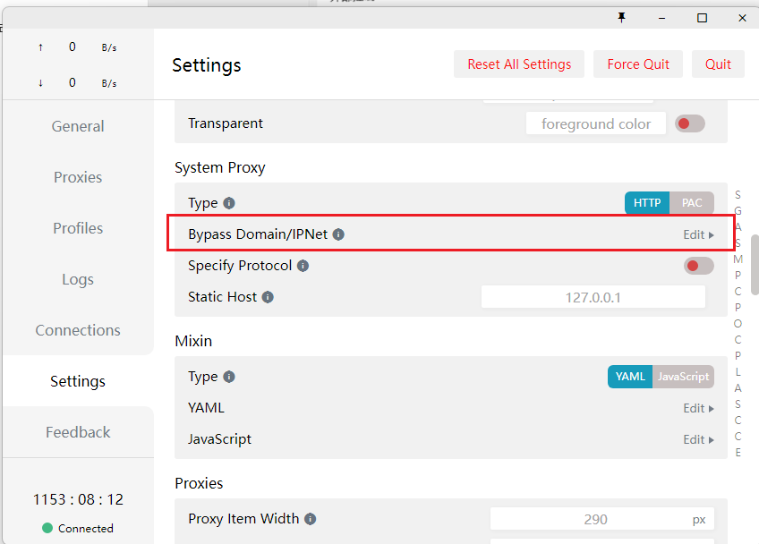
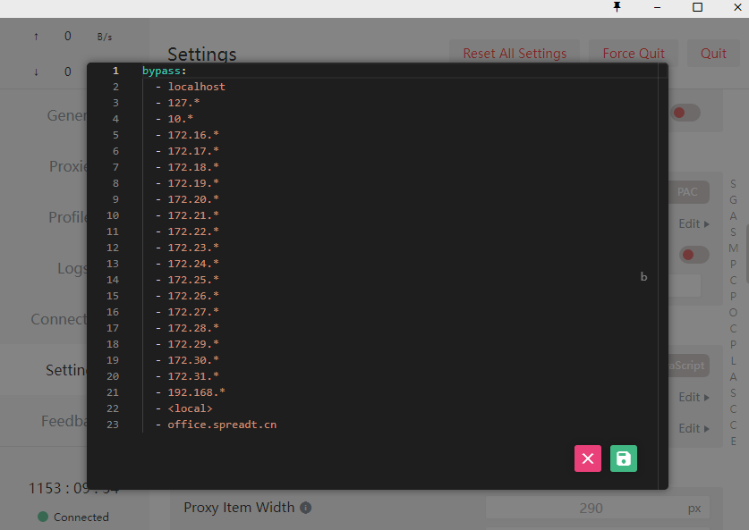

# 设置绕过代理
## 系统代理绕过(bypass system proxy)
如果使用的是系统代理的默认模式，可以通过设置代理绕过配置来决定哪些请求不使用系统代理。

进入 Settings 页面, 点击 System proxy Bypass 右边 Edit 小字打开编辑界面:

若要增加绕过 `office.spreadt.cn` 域名，只需在修改编辑界面内容为：

点击编辑器右下角保存

> bypass 类型为数组，item 为需要绕过的域名或节点，支持通配符 *