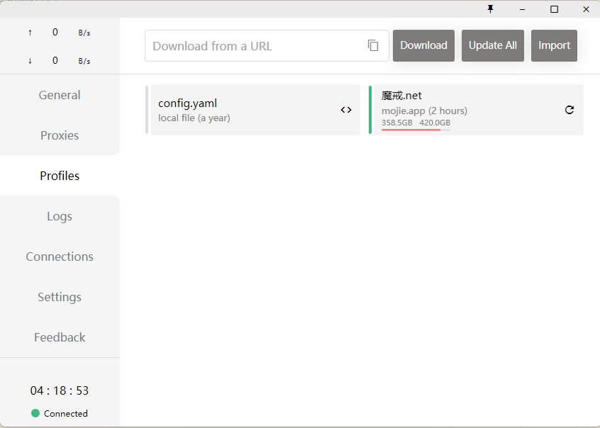
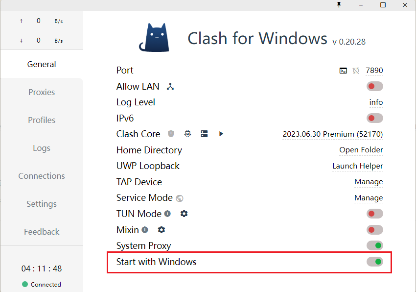
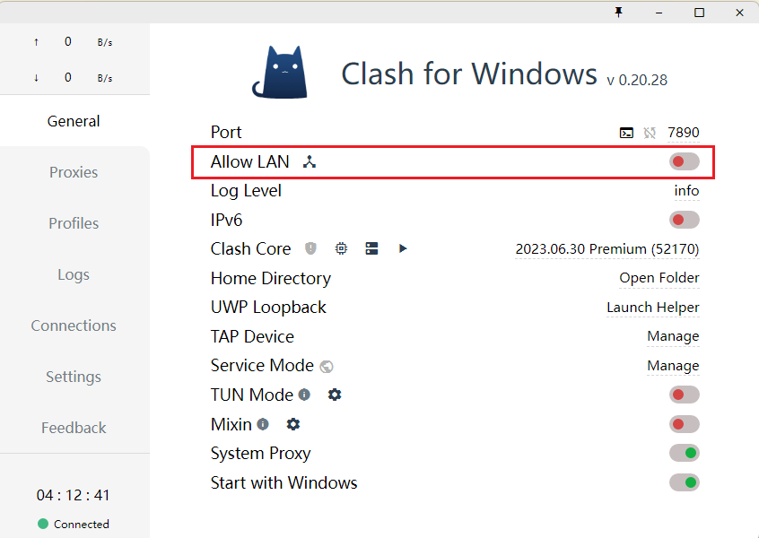
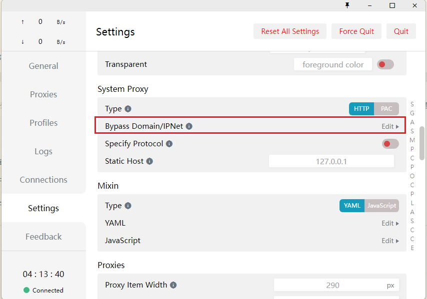
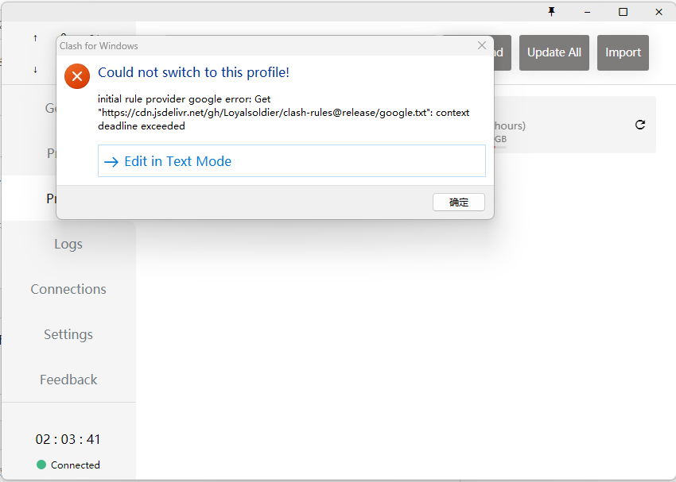
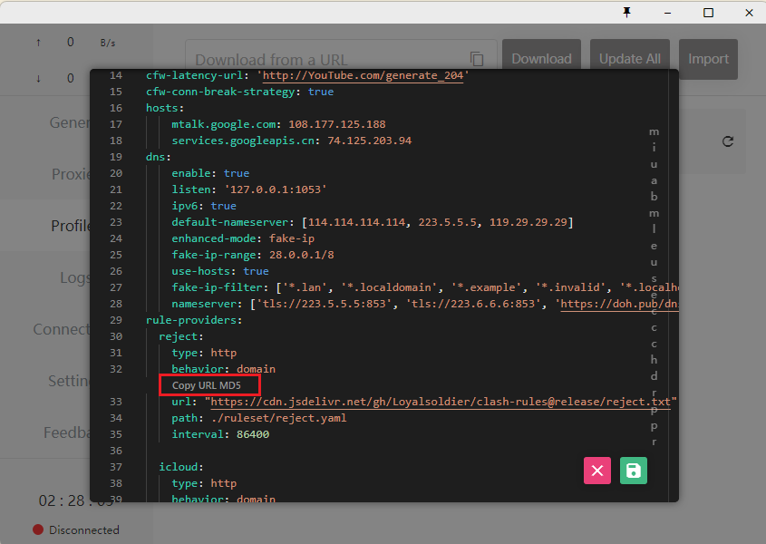

# Clash 教程
## 缩写
`CFW` Clash for Windows
## 配置文件以及模式
导入规则，也就是在左侧的 Profiles 栏，点击后可以看到只有一个默认的 config.yaml ，当然这个配置文件也并没有什么内容，仅仅是直连或者拒绝连接；我们需要做的是导入自己的配置文件，一般都会有订阅链接，将订阅链接粘贴到上方编辑框中，然后点击右侧的 Download 按钮即可下载并导入配置文件到 Clash，或者也可以点击 Import 按钮手动导入下载好的配置文件。可以修改配置文件、修改策略、修改规则。



添加了配置文件后，就可以选择节点进行使用了，点击左侧的 Proxies ，即可选择不同的代理节点，有几个默认项需要明确：

| proxy mode | description                                                                                                                                                   |
| ---------- | ------------------------------------------------------------------------------------------------------------------------------------------------------------- |
| Global     | 全局代理，所有的连接不加判断都走代理； 适用于用户希望所有流量都经过代理的场景。使用 Global 模式时，用户无需关心具体的流量规则，适合对网络要求较为简单的用户。 |
| Rule       | 规则代理，用户可以根据具体的网址、IP 地址、端口等条件来指定流量的走向。                                                                                       |
| Direct     | 直连，不走代理。适用于用户希望特定流量不经过代理进行访问的场景，如国内网站访问等。                                                                            |
| Script     | 它允许用户通过自定义脚本对流量进行处理和转发。用户可以编写脚本来实现对特定流量的处理逻辑，如 URL 重定向、请求头修改等。                                       |
| PAC (SSR)     | 全称 Proxy Auto-Configuration, 在 PAC 模式下，代理软件会根据用户所访问的网站进行智能判断，将需要代理的网站和服务通过 PAC 文件过滤出来，只有这些流量会通过代理服务器进行访问，其余的流量仍然直连。这种模式下，代理软件会根据 PAC 文件的规则实现自动化智能判断，不需要用户手动配置代理规则，比较方便。|

比较常用的是 Rule ，按规则走代理，也就是国内的网站没必要走代理，针对性的有需要的网站才走代理。

选择好代理节点后，还需要回到常规设置中开启系统代理，即打开 System Proxy , 就可以科学上网了。

## 开机自启动
打开常规设置中的 Start with Windows, 即可开机自启。



## 局域网使用代理
打开常规设置中的 Allow LAN 可以开启透明代理，也就是开启后局域网内的设备都可以使用代理，比如连接同一个 WiFi 的手机只需要在 WiFi 设置中设置代理服务器即可。Clash 端口默认为 7890；



## 绕过代理
开启代理后国内的一些网站反而打不开了，关掉系统代理就可以了。当然还有一个一劳永逸的办法就是设置绕过系统代理，点击左侧的 Settings 项，找到 Bypass Domain/IPNet 点击右侧 Edit ，添加自己需要绕过代理的 IP 或域名即可，支持使用通配符 * ，比如将所有 .cn 的域名绕过代理就可以设置 - "*.cn" 。



## 自定义规则
开启代理后似乎很多国内网站都不能访问，添加 Bypass 虽然能解决问题，但一方面很麻烦，另一方面像有些软件，不知道 IP 或者域名就没法添加到 Bypass 中，也就只能临时关闭系统代理了，体验并不太好。

而实际上 SSR 有一个功能就是自动更新 PAC 规则，使用起来基本上就是很无感，开启后就不再需要设置什么了，挺好用的，说实话我确实好奇过 Clash 应该也有类似的东西吧？

Clash 也有类似 SSR 的功能，叫**Clash Premium 规则集**: https://github.com/Loyalsoldier/clash-rules, 使用这个规则集必须确保使用 **Clash for Windows 0.12.1 或以上版本**

在软件的配置文件中添加 `rule-providers` 和 `rules` 。

软件的配置文件可以在常规设置中找到 General YAML ，点击右侧的 Text Mode Edit 进行编辑，未经修改的默认内容大致如下：

```yaml
mixed-port: 7890
allow-lan: false
log-level: info
external-controller: '127.0.0.1:9090'
secret: ''
ipv6: false

# Will be ignored after profile selection
proxies:
  - name: Debug
    type: socks5
    server: 127.0.0.1
    port: 1080
proxy-groups:
  - name: Proxy
    type: select
    proxies:
      - Debug
rules:
  - MATCH,DIRECT
```

具体添加步骤参考说明文档：https://github.com/Loyalsoldier/clash-rules/blob/master/README.md

这里简单说几个小白可能看起来比较头疼的地方：

* 直接复制添加 `rule-providers` 和 `rules` ，默认配置已经有 rules 项，把其中的内容替换掉；
* 删除所有带 `PROCESS-NAME` 的行，`在 Clash for Windows` 中无效；
* 默认配置中没有 `PROXY` 项，说明文档中让自行在 `proxies` 或 `proxy-groups` 中配置一个 `name` 为 `PROXY` 的 policy ，其实我不太懂怎么配置，考虑到默认的 `Proxy` 项并没有使用，所以我的解决办法就是直接把原有的 `Proxy` 修改为 PROXY 即可。

最终的配置文件将会是这样的：

```yaml
mixed-port: 7890
allow-lan: false
log-level: info
external-controller: '127.0.0.1:9090'
secret: ''
ipv6: false

rule-providers:
  reject:
    type: http
    behavior: domain
    url: "https://raw.githubusercontent.com/Loyalsoldier/clash-rules/release/reject.txt"
    path: ./ruleset/reject.yaml
    interval: 86400

  icloud:
    type: http
    behavior: domain
    url: "https://raw.githubusercontent.com/Loyalsoldier/clash-rules/release/icloud.txt"
    path: ./ruleset/icloud.yaml
    interval: 86400

  apple:
    type: http
    behavior: domain
    url: "https://raw.githubusercontent.com/Loyalsoldier/clash-rules/release/apple.txt"
    path: ./ruleset/apple.yaml
    interval: 86400

  google:
    type: http
    behavior: domain
    url: "https://raw.githubusercontent.com/Loyalsoldier/clash-rules/release/google.txt"
    path: ./ruleset/google.yaml
    interval: 86400

  proxy:
    type: http
    behavior: domain
    url: "https://raw.githubusercontent.com/Loyalsoldier/clash-rules/release/proxy.txt"
    path: ./ruleset/proxy.yaml
    interval: 86400

  direct:
    type: http
    behavior: domain
    url: "https://raw.githubusercontent.com/Loyalsoldier/clash-rules/release/direct.txt"
    path: ./ruleset/direct.yaml
    interval: 86400

  cncidr:
    type: http
    behavior: ipcidr
    url: "https://raw.githubusercontent.com/Loyalsoldier/clash-rules/release/cncidr.txt"
    path: ./ruleset/cncidr.yaml
    interval: 86400

  lancidr:
    type: http
    behavior: ipcidr
    url: "https://raw.githubusercontent.com/Loyalsoldier/clash-rules/release/lancidr.txt"
    path: ./ruleset/lancidr.yaml
    interval: 86400

# Will be ignored after profile selection
proxies:
  - name: Debug
    type: socks5
    server: 127.0.0.1
    port: 1080

proxy-groups:
  - name: PROXY
    type: select
    proxies:
      - Debug

rules:
  - RULE-SET,reject,REJECT
  - RULE-SET,icloud,DIRECT
  - RULE-SET,apple,DIRECT
  - RULE-SET,google,DIRECT
  - RULE-SET,proxy,PROXY
  - RULE-SET,direct,DIRECT
  - RULE-SET,lancidr,DIRECT,no-resolve
  - RULE-SET,cncidr,DIRECT,no-resolve
  - MATCH,PROXY
```

如果无法访问域名 `raw.githubusercontent.com`，可以使用第二个地址（`cdn.jsdelivr.net`），但是内容更新会有 12 小时的延迟。以下地址填写在 Clash 配置文件里的 `rule-providers` 里的 `url` 配置项中。

```yaml
rule-providers:
  reject:
    type: http
    behavior: domain
    url: "https://cdn.jsdelivr.net/gh/Loyalsoldier/clash-rules@release/reject.txt"
    path: ./ruleset/reject.yaml
    interval: 86400

  icloud:
    type: http
    behavior: domain
    url: "https://cdn.jsdelivr.net/gh/Loyalsoldier/clash-rules@release/icloud.txt"
    path: ./ruleset/icloud.yaml
    interval: 86400

  apple:
    type: http
    behavior: domain
    url: "https://cdn.jsdelivr.net/gh/Loyalsoldier/clash-rules@release/apple.txt"
    path: ./ruleset/apple.yaml
    interval: 86400

  google:
    type: http
    behavior: domain
    url: "https://cdn.jsdelivr.net/gh/Loyalsoldier/clash-rules@release/google.txt"
    path: ./ruleset/google.yaml
    interval: 86400

  proxy:
    type: http
    behavior: domain
    url: "https://cdn.jsdelivr.net/gh/Loyalsoldier/clash-rules@release/proxy.txt"
    path: ./ruleset/proxy.yaml
    interval: 86400

  direct:
    type: http
    behavior: domain
    url: "https://cdn.jsdelivr.net/gh/Loyalsoldier/clash-rules@release/direct.txt"
    path: ./ruleset/direct.yaml
    interval: 86400

  private:
    type: http
    behavior: domain
    url: "https://cdn.jsdelivr.net/gh/Loyalsoldier/clash-rules@release/private.txt"
    path: ./ruleset/private.yaml
    interval: 86400

  gfw:
    type: http
    behavior: domain
    url: "https://cdn.jsdelivr.net/gh/Loyalsoldier/clash-rules@release/gfw.txt"
    path: ./ruleset/gfw.yaml
    interval: 86400

  tld-not-cn:
    type: http
    behavior: domain
    url: "https://cdn.jsdelivr.net/gh/Loyalsoldier/clash-rules@release/tld-not-cn.txt"
    path: ./ruleset/tld-not-cn.yaml
    interval: 86400

  telegramcidr:
    type: http
    behavior: ipcidr
    url: "https://cdn.jsdelivr.net/gh/Loyalsoldier/clash-rules@release/telegramcidr.txt"
    path: ./ruleset/telegramcidr.yaml
    interval: 86400

  cncidr:
    type: http
    behavior: ipcidr
    url: "https://cdn.jsdelivr.net/gh/Loyalsoldier/clash-rules@release/cncidr.txt"
    path: ./ruleset/cncidr.yaml
    interval: 86400

  lancidr:
    type: http
    behavior: ipcidr
    url: "https://cdn.jsdelivr.net/gh/Loyalsoldier/clash-rules@release/lancidr.txt"
    path: ./ruleset/lancidr.yaml
    interval: 86400

  applications:
    type: http
    behavior: classical
    url: "https://cdn.jsdelivr.net/gh/Loyalsoldier/clash-rules@release/applications.txt"
    path: ./ruleset/applications.yaml
    interval: 86400
```

保存后软件会自动加载设置，不出意外的话软件会自动下载 `rule-providers` 中配置的规则文件，保存在配置文件根目录下的 `ruleset` 文件夹中，这里可以自行验证一下，在常规设置中找到 Home Directory ，点击右侧 Open Folder 可以直接打开配置文件根目录。成功下载规则文件将会是下图这样：

如果没能下载下来，可以尝试替换链接，规则集的说明文档中有相关说明。

大概就已经可以正常使用了，可以自行测试一下。这里很尴尬的一点是，有没有配置成功似乎只能实际去访问一些网站试试，软件本身不会有任何提示。

### 无法下载 rule-providers 规则文件
配置完 `rule-providers` 有可能发生 `context deadline exceed` 的错误：



网络问题，无法更新下载 `rule-providers` 文件，并且不走代理。

可以自行下载这些文件放在指定的目录; 或者重启几次 Clash 试一试。

文件名必须修改成对应的 md5 名称。



## 参考
https://mxy493.github.io/2020101017609/
https://github.com/Loyalsoldier/clash-rules/issues/92
https://blog.skk.moe/post/what-happend-to-dns-in-proxy/