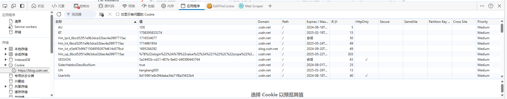

# Cookie
## 什么是 Cookie
Cookie 最开始被设计出来是为了弥补 HTTP 在状态管理上的不足。HTTP 协议是一个无状态协议，客户端向服务器发请求，服务器返回响应，故事就这样结束了，但是下次发请求如何让服务端知道客户端是谁呢？这种背景下，就产生了 Cookie。

* **cookie 存储在客户端**： cookie 是服务器发送到用户浏览器并保存在本地的一小块数据，它会在浏览器下次向同一服务器再发起请求时被携带并发送到服务器上。因此，服务端脚本就可以读、写存储在客户端的 cookie 的值。
* **cookie 是不可跨站的**： 每个 cookie 都绑定在特定的域名下（绑定域名下的子域都是有效的），无法在别的域名下获取使用，**同域名不同端口也允许共享**。

可以在浏览器控制台的 Application 面板查看 Cookie：



## Cookie 的应用
* **会话状态管理**: 如用户登录状态、购物车、游戏分数或其他需要记录的信息
* **个性化设置**: 如用户自定义设置、主题和其他设置
* **浏览器行为跟踪**: 如跟踪分析用户行为等

## Cookie 的数据流转
* 在首次访问网站时，浏览器发送请求中并未携带 Cookie。
* 浏览器看到请求中未携带 Cookie，在 HTTP 的响应头中加入 Set-Cookie。
* 浏览器收到 Set-Cookie 后，会将 Cookie 保存下来
* 下次再访问该网站时，HTTP 请求头就会携带 Cookie。

服务器第一次发送标头告知客户端存储一对 cookie：

```http
Set-Cookie: yummy_cookie=choco
Set-Cookie: tasty_cookie=strawberry
```

对该服务器发起的每一次新请求，浏览器都会将之前保存的 Cookie 信息通过 Cookie 请求头部再发送给服务器。

```http
Cookie: yummy_cookie=choco; tasty_cookie=strawberry
```

## 检测 cookie 是否启用
有些用户为了避免隐私泄露会在它们的浏览器中禁用 cookie。因此，在 js 代码使用 cookie 前，首先要确保 cookie 是启用的。可以用 `navigator.cookieEnabled` 属性来判断，如果值为 `true`，则当前 cookie 是启用的；反之则是禁用的（但是，只具备 “当前浏览器会话生命周期” 的非持久化 cookie 仍然是启用的）。

## cookie 属性：有效期和作用域
cookie 默认的有效期很短暂，它只能维持在 Web 浏览器的会话期间，一旦用户关闭浏览器，cookie 保存的数据就丢失了。要注意的是，这与 sessionStorage 的有效期还是有区别的：cookie 的作用域不是局限在浏览器的单个窗口中，它的有效期和整个浏览器进程而不是单个浏览器窗口的有效期一致。如果想要延长 cookie 的有效期，可以通过设置 max-age 属性。一旦设置了有效期，浏览器就会将 cookie 数据存储在一个文件中，并且直到过了指定的有效期才会删除该文件。

cookie 的作用域是通过文档源和文档路径来确定的。该作用域通过 cookie 的 path 和 domain 属性可配置。

## Cookie 常见属性
| 属性       | 说明                                                                                                                                                                                                                                                                                                                         |
| :--------- | :--------------------------------------------------------------------------------------------------------------------------------------------------------------------------------------------------------------------------------------------------------------------------------------------------------------------------- |
| name=value | 键值对，设置 Cookie 的名称及相对应的值，都必须是字符串类型（name 不区分大小写） <br>- 如果值为 Unicode 字符，需要为字符编码。 <br>- 如果值为二进制数据，则需要使用 base64 编码。                                                                                                                                             |
| domain     | Cookie 生效的域名，即 Cookie 在哪个网站生效。默认当前访问域名。<br> 例如我们在 a.jzplp.com 下设置的 Cookie，就只在这个域名下生效。但是如果我们设置了 domain=jzplp.com，则该 Cookie 可以在 jzplp.com 下的任何域名内生效。比如：jzplp.com，a.jzplp.com, b.jzplp.com。<br> domain 只能设置为当前服务器的域。                    |
| path       | 有时候，我们希望 Cookie 仅仅在部分路径下生效，就可以使用 Path 进行限制。这里的路径就是网站的路由。默认的 path=/，即在所有路径下生效。 如果设置了 path=/abc，则只在 /abc 路径下生效。比如： <br> jzplp.com 不生效 <br> jzplp.com/abc 生效 <br> jzplp.com/abc/def 生效 <br> jzplp.com/qaz 不生效 <br> jzplp.com/qaz/abc 不生效 |
| expires    | 过期时间（GMT 时间格式），当浏览器端本地的当前时间超过这个时间时，Cookie 便会失效。 <br> 如果客户端和服务器时间不一致，使用 expires 就会存在偏差。 <br> 一般浏览器的 cookie 都是默认储存的，当关闭浏览器结束这个会话的时候，cookie 会被删除。<br> Expires 格式：Expires=Wed, 21 Oct 2015 07:28:00 GMT。                      |
| Max-age    | cookie 存活时间，单位秒。如果为正数，则该 cookie 在 maxAge 秒后失效。如果为负数，该 cookie 为临时 cookie ，关闭浏览器即失效，浏览器也不会以任何形式保存该 cookie 。如果为 0，表示删除该 cookie 。默认为 -1。 <br> - 优先级高于 expires                                                                                       |
| HttpOnly   | 如果给某个 cookie 设置了 httpOnly 属性，则无法通过 js 读写该 cookie 的信息，但还是能通过 Application 中手动修改 cookie，所以只是在一定程度上可以防止 CSRF 攻击，不是绝对的安全                                                                                                                                               |
| secure     | 该 cookie 是否仅被使用安全协议传输。安全协议有 HTTPS，SSL 等，在网络上传输数据之前先将数据加密。默认为 false。<br> 当 secure 值为 true 时，cookie 在 HTTP 中是无效的。                                                                                                                                                       |
| SameSite   | 是否允许跨站请求时发送 Cookie                                                                                                                                                                                                                                                                                                |
| Priority   | 当 Cookie 的数量超过限制时，路蓝旗会清除一部分 Cookie。清除哪些合适呢？Priority 属性用来定义 Cookie 的优先级，低优先级的 Cookie 会优先被清除。 <br> Priority 属性有三种： Low, Medium, High。                                                                                                                                |

## 参考
https://blog.csdn.net/huangpb123/article/details/109107461