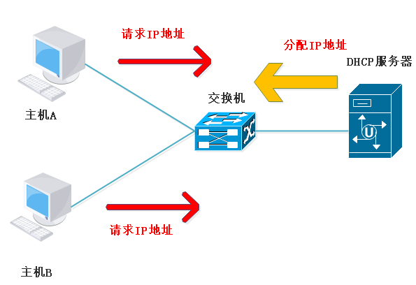
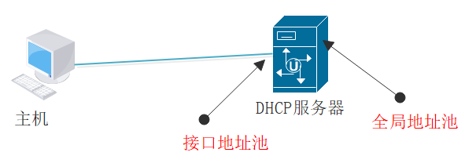

# DHCP 的原理与配置
## DHCP 的概念及优势
### DHCP 的概念
DHCP (Dynamic Host Configuration Protocol，动态主机配置协议) 是一个局域网的网络协议，使用 UDP 协议工作

主要有两个用途：

* 给内部网络或网络服务供应商自动分配 IP 地址
* 给用户或者内部网络管理员作为对所有计算机作中央管理的手段

简单来说：给局域网内的机器分 IP 地址。

### DHCP 在实际中应用的优势
在大型企业网络中，会有大量的主机或设备需要获取 IP 地址等网络参数。如果采用手工配置，工作量大且不好管理，如果有用户擅自修改网络参数，还有可能会造成 IP 地址冲突等问题，使用动态主机配置协议 DHCP 来分配 IP 地址等网络参数，可以减少管理员的工作量，避免用户手工配置网络参数时造成的地址冲突。

## DHCP 的应用场景
DHCP 服务器能够为大量主机分配 IP 地址，并能够集中管理

## DHCP 的地址池类型
### 全局地址池
全局地址池就是可以给任何接口地址提供 DHCP 服务，同时你可以创建多个全局地址池使用，其中全局地址池网段与端口 IP 是同一网段的对应关系，实现自动获取 IP 的作用。

### 接口地址池
接口地址池就是给端口配置 IP，这个 IP 作为网关使用，这个端口下面的 PC 都可以 DHCP 分配到 IP 地址

## 转载与参考
https://www.cnblogs.com/weq0805/p/14806958.html