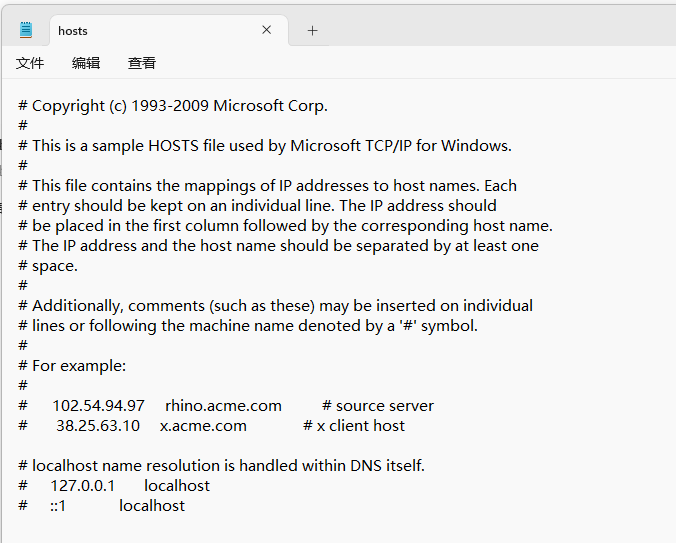
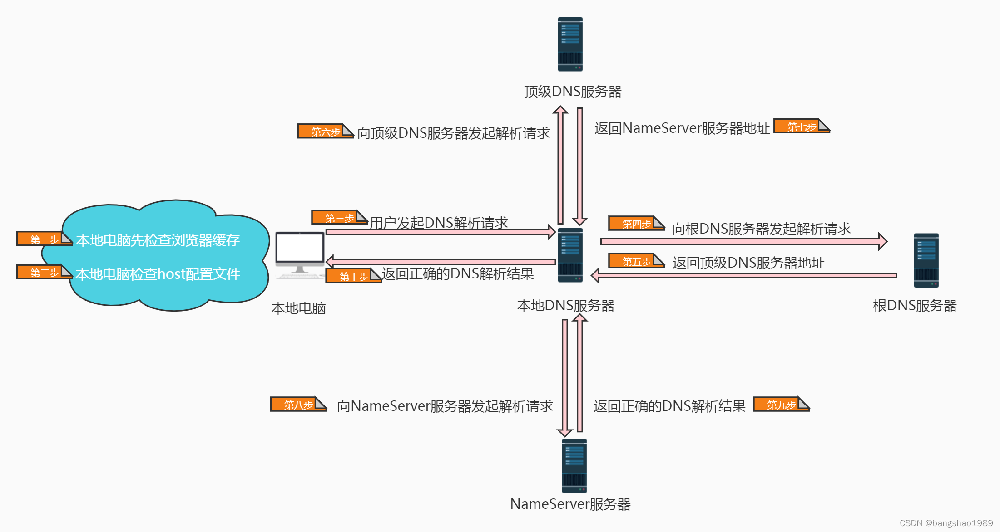

# 域名解析协议(DNS)
## 什么是 DNS 域名解析
我们首先要了解域名和 IP 地址的区别。IP 地址是互联网上计算机唯一的逻辑地址，通过 IP 地址实现不同计算机之间的相互通信，每台联网计算机都需要通过 IP 地址来互相联系和分别。

但由于 IP 地址是由一串容易混淆的数字串构成，人们很难记忆所有计算机的 IP 地址，这样对于我们日常工作生活访问不同网站是很困难的。基于这种背景，人们在 IP 地址的基础上又发展出了一种更易识别的符号化标识，这种标识由人们自行选择的字母和数字构成，相比 IP 地址更易被识别和记忆，逐渐代替 IP 地址成为互联网用户进行访问互联的主要入口。**这种符号化标识就是域名。**

域名虽然更易被用户所接受和使用，但计算机只能识别纯数字构成的 IP 地址，不能直接读取域名。因此要想达到访问效果，就需要**将域名翻译成 IP 地址**。而 **DNS 域名解析**承担的就是这种翻译效果。

## hosts 文件
域名和 IP 的对应关系保存在本地计算机 `hosts` 文件中。 `hosts` 文件存放位置：

* Windows: `C:\Windows\System32\drivers\etc\hosts`
* Linux: `/etc/hosts`

## nameserver
**名称服务器（Name Server）** 是互联网域名系统（DNS）中的一部分，它们负责将用户可读的域名（例如：www.example.com）解析为计算机可识别的 IP 地址（例如：192.168.1.1）。这使得我们可以使用容易记忆的域名访问网站，而不是需要记住复杂数字的 IP 地址。

名称服务器通常由域名注册商或托管服务提供商管理。当你为一个域名配置名称服务器时，你实际上是告诉互联网如何找到负责管理你的域名解析的服务器。名称服务器通常有主服务器和辅助服务器，以确保在其中一个服务器出现问题时，另一个服务器可以继续为解析请求提供服务。

**名称服务器**是域名提供服务的服务商，它用于存放你的域名信息，它相当于网络上的空间服务商 idc。在域名商的管理界面可以看到 nameserver，一般有俩。

而 dns 服务器是给用户提供域名查询服务的，它的地位相当于网络上的宽带服务商。

## 域名服务器
域名是分层结构，域名服务器也是对应的层级结构。

有了域名结构，还需要有一个东西去解析域名，域名需要由遍及全世界的域名服务器去解析，域名服务器实际上就是装有域名系统的主机。

由高向低进行层次划分，可分为以下几大类：

| 分类           | 作用                                                              |
| :------------- | :---------------------------------------------------------------- |
| 根域名服务器   | 最高层次的域名服务器，本地域名服务器解析不了的域名就会向其求助    |
| 顶级域名服务器 | 负责管理在该顶级域名服务器下注册的二级域名                        |
| 权限域名服务器 | 负责一个区的域名解析工作                                          |
| 本地域名服务器 | 当一个主机发出 DNS 查询请求时，这个查询请求首先发给本地域名服务器 |

> 注：一个域名服务器所负责的范围，或者说有管理权限的范围，就称为区

我们需要注意的是：

1. 每个层的域名上都有自己的域名服务器，最顶层的是根域名服务器
2. 每一级域名服务器都知道下级域名服务器的 IP 地址
3. 为了容灾，每一级至少设置两个或以上的域名服务器

## DNS 域名解析过程

当我们在浏览器地址栏中输入 `www.baidu.com` 时，DNS 解析将会有将近 10 个步骤，这个过程大体大体由上图可以表示：

整个过程大体描述如下，其中前两个步骤是在**本地电脑内完成的**，后 8 个步骤涉及到**真正的域名解析服务器**：

**第一步**: 本地电脑会检查浏览器缓存中有没有这个域名对应的解析过的 IP 地址，如果缓存中有，这个解析过程就结束。浏览器缓存域名也是有限制的，不仅浏览器缓存大小有限制，而且缓存的时间也有限制，通常情况下为几分钟到几小时不等，域名被缓存的时间限制可以通过 TTL 属性来设置。这个缓存时间太长和太短都不太好，如果时间太长，一旦域名被解析到的 IP 有变化，会导致被客户端缓存的域名无法解析到变化后的 IP 地址，以致该域名不能正常解析，这段时间内有一部分用户无法访问网站。如果设置时间太短，会导致用户每次访问网站都要重新解析一次域名。

**第二步**: 如果浏览器缓存中没有数据，浏览器会查找操作系统缓存中是否有这个域名对应的 DNS 解析结果。其实操作系统也有一个域名解析的过程，在 Linux 中可以通过 `/etc/hosts` 文件来设置，而在 windows 中可以通过配置 `C:\Windows\System32\drivers\etc\hosts` 文件来设置，用户可以将任何域名解析到任何能够访问的 IP 地址。例如，我们在测试时可以将一个域名解析到一台测试服务器上，这样不用修改任何代码就能测试到单独服务器上的代码的业务逻辑是否正确。正是因为有这种本地 DNS 解析的规程，所以有黑客就可能通过修改用户的域名来把特定的域名解析到他指定的 IP 地址上，导致这些域名被劫持。

**第三步**: 前两个过程无法解析时，就要用到我们网络配置中的 "**DNS 服务器地址**" 了。操作系统会把这个域名发送给这个本地 DNS 服务器。每个完整的内网通常都会配置本地 DNS 服务器，例如用户是在学校或工作单位接入互联网，那么用户的本地 DNS 服务器肯定在学校或工作单位里面。它们一般都会缓存域名解析结果，当然缓存时间是受到域名的失效时间控制的。大约 80% 的域名解析到这里就结束了，后续的 DNS 迭代和递归也是由本地 DNS 服务器负责。

* windows 在这配置：`控制面板` >> `网络和共享中心` >> `更改适配器设置` >> `选中目标适配器右键选择属性` >> `Internet 协议版本 4 (TCP/IPv4)` >> `配置 DNS 地址`。
* Linux 在这设置：`/etc/resolv.conf`。

**第四步**: 如果本地 DNS 服务器仍然没有命中，就直接到根 DNS 服务器请求解析。

**第五步**: 根 DNS 服务器返回给本地 DNS 域名服务器一个顶级 DNS 服务器地址，它是国际顶级域名服务器，如.com、.cn、.org 等，全球只有 13 台左右。

**第六步**: 本地 DNS 服务器再向上一步获得的顶级 DNS 服务器发送解析请求。

**第七步**: 接受请求的顶级 DNS 服务器查找并返回此域名对应的 Name Server 域名服务器的地址，这个 Name Server 服务器就是我要访问的网站域名提供商的服务器，其实该域名的解析任务就是由域名提供商的服务器来完成。   比如我要访问 www.baidu.com，而这个域名是从 A 公司注册获得的，那么 A 公司上的服务器就会有 www.baidu.com 的相关信息。

**第八步**: Name Server 服务器会查询存储的域名和 IP 的映射关系表，再把查询出来的域名和 IP 地址等等信息，连同一个 TTL 值返回给本地 DNS 服务器。

**第九步**: 返回该域名对应的 IP 和 TTL 值，本地 DNS 服务器会缓存这个域名和 IP 的对应关系，缓存时间由 TTL 值控制。

**第十步**: 把解析的结果返回给本地电脑，本地电脑根据 TTL 值缓存在本地系统缓存中，域名解析过程结束在实际的 DNS 解析过程中，可能还不止这 10 步，如 Name Server 可能有很多级，或者有一个 GTM 来负载均衡控制，这都有可能会影响域名解析过程。

## 递归查询和迭代查询的区别
DNS 客户端和本地名称服务器是**递归**，而本地名称服务器和其他名称服务器之间是**迭代**。

- **DNS 递归名称解析**： 在 DNS 递归名称解析中，当所配置的本地名称服务器解析不了时，后面的查询工作是由本地名称服务器替代 DNS 客户端进行的（以 “本地名称服务器” 为中心），只需要本地名称服务器向 DNS 客户端返回最终的查询结果即可。
- **DNS 迭代名称解析**：（或者叫 “迭代查询”）的所有查询工作全部是 DNS 客户端自己进行（以 “DNS 客户端” 自己为中心）。在条件之一满足时就会采用迭代名称解析方式：
	- 在查询本地名称服务器时，如果客户端的请求报文中没有申请使用递归查询，即在 DNS 请求报头部的 RD 字段没有置 1。相当于说 “你都没有主动要求我为你进行递归查询，我当然不会为你工作了”。
	- 客户端在 DNS 请求报文中申请使用的是递归查询（也就是 RD 字段置 1 了），但在所配置的本地名称服务器上是禁用递归查询（DNS 服务器一般默认支持递归查询的），即在应答 DNS 报文头部的 RA 字段置 0。

> 通俗地说:
> * 递归就是把一件事情交给别人，如果事情没有办完，哪怕已经办了很多，都不要把结果告诉我，我要的是你的最终结果，而不是中间结果；如果你没办完，请你找别人办完。
> * 迭代则是我交给你一件事，你能办多少就告诉我你办了多少，然后剩下的事情就由我来办。

## DNS 劫持

**DNS 劫持**就是通过劫持了 DNS 服务器，通过某些手段取得某域名的解析记录控制权，进而修改此域名的解析结果，导致对该域名的访问由原 IP 地址转入到修改后的指定 IP，其结果就是对特定的网址不能访问或访问的是假网址，从而实现窃取资料或者破坏原有正常服务的目的。DNS 劫持通过篡改 DNS 服务器上的数据返回给用户一个错误的查询结果来实现的。

**DNS 劫持症状**：在某些地区的用户在成功连接宽带后，首次打开任何页面都指向 ISP 提供的 “电信互联星空”、“网通黄页广告” 等内容页面。还有就是曾经出现过用户访问 Google 域名的时候出现了百度的网站。这些都属于 DNS 劫持。

**解决方法**: 对于 DNS 劫持，可以采用使用国外免费公用的 DNS 服务器解决。例如 OpenDNS（208.67.222.222）或 GoogleDNS（8.8.8.8）。

## DNS 污染

**DNS 污染**是一种让一般用户由于得到虚假目标主机 IP 而不能与其通信的方法，是一种 DNS 缓存投毒攻击（DNS cache poisoning）。其工作方式是：由于通常的 DNS 查询没有任何认证机制，而且 DNS 查询通常基于的 UDP 是无连接不可靠的协议，因此 DNS 的查询非常容易被篡改，通过对 UDP 端口 53 上的 DNS 查询进行入侵检测，一经发现与关键词相匹配的请求则立即伪装成目标域名的解析服务器（NS，Name Server）给查询者返回虚假结果。

而 DNS 污染则是发生在用户请求的第一步上，直接从协议上对用户的 DNS 请求进行干扰。

**DNS 污染症状**：目前一些被禁止访问的网站很多就是通过 DNS 污染来实现的，例如 YouTube、Facebook 等网站。

**解决方法**: 对于 DNS 污染，可以说，个人用户很难单单靠设置解决，通常可以使用 VPN 或者域名远程解析的方法解决，但这大多需要购买付费的 VPN 或 SSH 等，也可以通过修改 Hosts 的方法，手动设置域名正确的 IP 地址。

## 参考
https://blog.csdn.net/bangshao1989/article/details/121913780
https://blog.csdn.net/baidu_37964071/article/details/80500825
https://segmentfault.com/a/1190000003788294