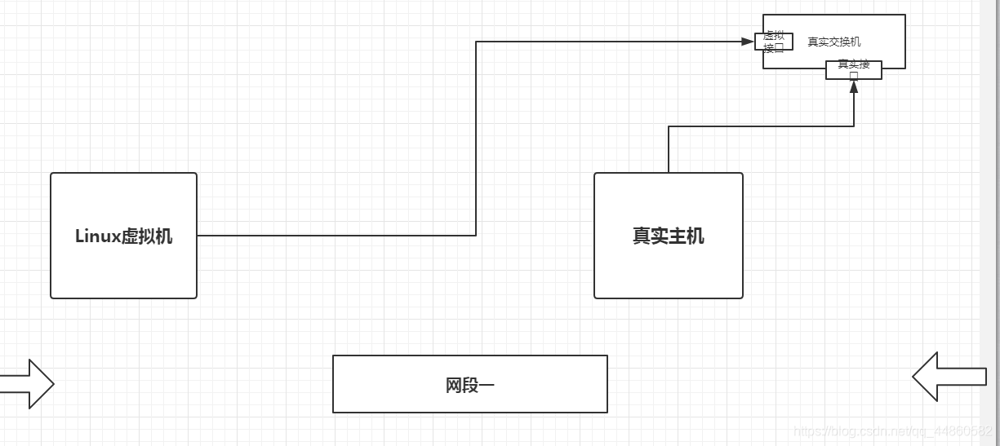

# NAT 模式和桥接模式的区别
1. 一般我们在创建一个 Linux 虚拟机时候，会面临两个网络配置选择：

* 桥接模式
* NAT 模式

## NAT 模式
所谓 NAT 模式，就是虚拟系统会通过宿主机的网络来访问外网，而这里的宿主机相当于有两个网卡，一个是真实网卡，一个是虚拟网卡，真实网卡相当于链接了现实世界的真实路由器，而宿主机的虚拟网卡，相当于链接了一个可以认为是虚拟交换机（这个虚拟交换机他同时链接了虚拟系统（linux）和宿主机）, 这个时候的虚拟网络想访问外网，就必须通过宿主机的 IP 地址，而外面看来也确实是宿主机的 IP 地址（实则是虚拟机访问的！！），完全看不到虚拟网络局域的内部形式，而这个时候 linux 和宿主机和虚拟交换机形成一个网段，宿主机和真实路由形成一个网段！！

优点：不需要自己来手动分配 IP 地址和子网掩码，只要宿主机能访问网络，他就能（注意，虚拟机可以 ping 宿主机，宿主机 ping 不了虚拟机）

## 桥接模式
这个相当于在一个局域网内创立了一个单独的主机，他可以访问这个局域网内的所有的主机，但是需要手动来配置 IP 地址，子网掩码，并且他是和真实主机在同一个网段（nat 是两个网段），这个模式里，虚拟机和宿主机可以互相 ping 通。

## 转载
https://blog.csdn.net/qq_27088383/article/details/108634985