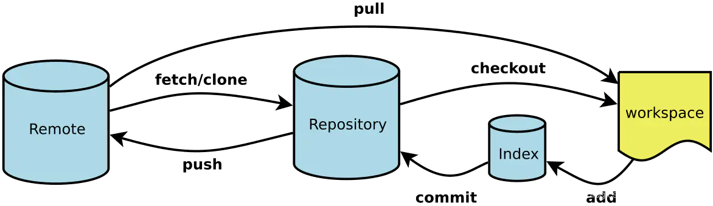
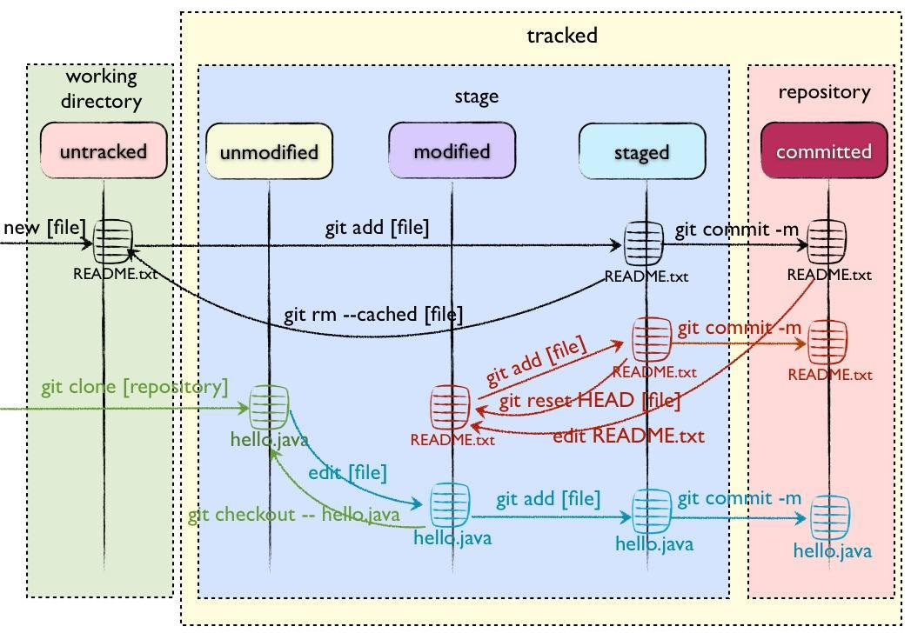

# 4 个区域
* **工作区（Working Area）**
是在电脑文件系统中能看到的项目目录。它包含项目的实际文件，你在工作区进行的修改会影响到这些文件。比如，你新创建了一个文件夹，`git init` 命令以后它就成为了一个 `git` 目录，然后你在文件夹里修改了一个 `readme.txt` 文件，也就是所谓的在工作区修改了它，这个很好理解。
* **暂存区（Stage/Index）**
是一个中间区域，用于暂存工作区中的改动，但这些改动还没有提交到本地仓库。在进行版本控制时，你需要明确地将修改添加到暂存区，这相当于一次 “快照”，在提交到本地仓库之前，你可以对这次 “快照” 进行进一步的调整。这个区域比较抽象，我们暂时不需要看到它，只用记住在提交到本地仓之前，先添加到这儿就行。
* **本地仓库（Local Repository）**
是存储在自己计算机本地的版本库，包含了完整的项目历史数据。执行 `git commit` 命令后会将暂存区的内容添加到这里，git 会保存为一个新的提交，并更新本地仓库，这样就形成了项目的版本历史。这个区域也比较抽象，暂时不用担心。
* **远程仓库（Remote Repository）**
是位于网络上的 git 仓库，通常托管在像 GitHub、GitLab 或 Bitbucket 等服务提供商上。远程仓库用于协作和备份。多个开发者可以共享同一个远程仓库，每个人可以将自己的改动推送到远程仓库，从而实现协同开发。同时，远程仓库也提供了项目的备份和存档。

关系示意图:

详细关系示意图:

* `Directory`：使用 Git 管理的一个目录，也就是一个仓库，包含我们的工作空间和 Git 的管理空间。
* `WorkSpace`：需要通过 Git 进行版本控制的目录和文件，这些目录和文件组成了工作空间。
* `.git`：存放 Git 管理信息的目录，初始化仓库的时候自动创建。
* `Index/Stage`：暂存区，或者叫待提交更新区，在提交进入 repo 之前，我们可以把所有的更新放在暂存区。
* `Local Repo`：本地仓库，一个存放在本地的版本库；HEAD 会只是当前的开发分支（branch）。

# 4 种状态

* **Untracked**: 未跟踪，此文件在文件夹中，但并没有加入到 git 库，不参与版本控制.  通过 `git add` 状态变为 `Staged`
* **Unmodify**: 文件已经入库，未修改，即版本库中的文件快照内容与文件夹中完全一致。这种类型的文件有两种去处， 如果它被修改，而变为 `Modified`. 如果使用 `git rm` 移出版本库，则成为 `Untracked` 文件
* **Modified**: 文件已修改，仅仅是修改，并没有进行其他的操作。这个文件也有两个去处， 通过 `git add` 可进入暂存 `staged` 状态，使用 `git checkout` 则丢弃修改过，返回到 `unmodify` 状态 , 这个 `git checkout` 即从库中取出文件，覆盖当前修改
* **Staged**: 暂存状态. 执行 `git commit` 则将修改同步到库中 , 这时库中的文件和本地文件又变为一致，文件为 `Unmodify` 状态. 执行 `git reset HEAD filename` 取消暂存 , 文件状态为 `Modified`

# git diff
`git diff`之间的关系如下图：

* 工作区中的文件初始的状态是未修改，当我们修改文件后，其状态改变为已修改，`git diff` 可以查看已经修改但未暂存的文件。(`git diff` 后输入 `q` 可以退出)
* 通过 `git add` 命令可以把已修改的文件添加到暂存区，`git diff --cached` 可以查看已暂存，但未提交的文件。
* 通过 `git commit` 进行代码提交到本地仓库，`git diff {本地分支} {远程分支}` 可以查看已提交本地，但未推送到远程的分支。
* 通过 `git push` 命令将本地分支推送到远程分支。

# 参考
https://blog.csdn.net/qing040513/article/details/109150075
https://blog.csdn.net/weixin_65775770/article/details/135421020
https://blog.csdn.net/qq_46921028/article/details/114904431
https://www.cnblogs.com/utank/p/12180531.html