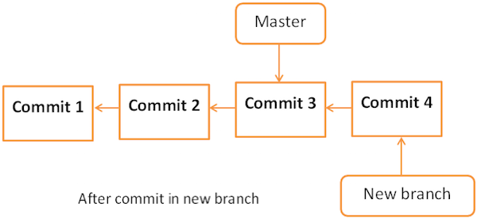
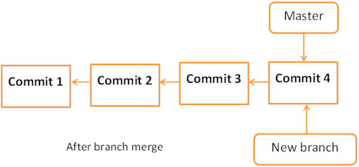

## 分支相关的命令
```bash
git branch                  # 列出本地已经存在的分支，并且当前分支会用*标记
git branch -r               # 查看远程版本库的分支列表
git branch -a               # 查看所有分支列表（包括本地和远程，remotes/开头的表示远程分支）
git branch -v               # 查看一个分支的最后一次提交
git branch --merged         # 查看哪些分支已经合并到当前分支
git branch --no-merged      # 查看所有未合并工作的分支
git branch -d [branch]      # 删除分支
git branch -D [branch]      # 强制删除分支
git checkout [branch]       # 切换分支
git checkout -b [branch]    # 创建并切换分支
```
## 创建分支
从现有分支创建一个新分支。可以使用特定的提交或标签作为起点。如果未提供任何特定的提交 ID，则该分支将以 HEAD 作为起点创建。

创建`new_branch`分支：
```bash
>>> git branch new_branch
```

查看当前全部的分支, `*`表示当前所在的分支:
```bash
>>> git branch
* master
new_branch
```

分支示意图：


## 切换分支
切换到`new_branch`分支:
```bash
>>> git checkout new_branch
Switched to branch 'new_branch'
```
查看当前全部的分支, 从`master`分支切换到了`new_branch`分支：
```bash
>>> git branch
master
* new_branch
```

## 创建并立即切换新的分支
上述分两个命令创建并切换新的分支:
```bash
>>> git branch test_branch
>>> git checkout test_branch
```
只用一个命令完成创建及切换新的分支：
```bash
>>> git checkout -b test_branch
Switched to a new branch 'test_branch'
```
查看当前全部的分支, 从`new_branch`分支切换到了`test_branch`分支：
```bash
>>> git branch
master
new_branch
* test_branch
```

## 删除分支
### 删除本地分支
在删除现有分支之前，请先切换到其他分支!!!

例如: 正在`test_branch`上，并且想要删除该分支。必须切换分支并执行以下操作来删除分支。

查看当前全部的分支：
```bash
>>> git branch
master
new_branch
* test_branch
```
切换至`master`分支:
```bash
>>> git checkout master
Switched to branch 'master'
```
删除`test_branch`分支
```bash
>>> git branch -D test_branch
Deleted branch test_branch (was 5776472).
```
再次查看当前全部的分支：
```bash
>>> git branch
* master
new_branch
```

### 删除远程分支
注意：分支名称前有个冒号，分支名前的冒号代表删除
```bash
>>> git push origin :分支名称
```

## 将新分支推送到远程仓库
```bash
>>> git push origin new_branch
```
如果本地创建了一个名为 `dev` 的分支，远程仓库还没有这个分支，推送的命令是：
```bash
>>> git push --set-upstream origin dev
```

## 重命名分支
查看当前全部的分支：
```bash
>>> git branch
* master
new_branch
```
将`new_branch`重命名成`wchar_support`:
```bash
>>> git branch -m new_branch wchar_support
```
查看当前全部的分支：
```bash
>>> git branch
* master
wchar_support
```

## 合并两个分支
查看当前全部的分支：
```bash
>>> git branch
* master
wchar_support
```
提交修改：
```bash
git add .
git commit -m 'submit to wchar_support'
```
推送到新的分支:
```bash
>>> git push -u origin wchar_support
Counting objects: 7, done.
Compressing objects: 100% (4/4), done.
Writing objects: 100% (4/4), 507 bytes, done.
Total 4 (delta 1), reused 0 (delta 0)
To gituser@git.server.com:project.git
* [new branch]
wchar_support -> wchar_support
```
分支示意图：


查看来自`wchar_support`分支的日志:
```bash
>>> git log origin/wchar_support -2
commit 64192f91d7cc2bcdf3bf946dd33ece63b74184a3
Author: Jerry Mouse <jerry@tutorialspoint.com>
Date: Wed Sep 11 16:10:06 2013 +0530

Added w_strlen function to return string lenght of wchar_t string


commit 577647211ed44fe2ae479427a0668a4f12ed71a1
Author: Tom Cat <tom@tutorialspoint.com>
Date: Wed Sep 11 10:21:20 2013 +0530

Removed executable binary
```
切换到 `master` 分支上:
```bash
>>> git checkout master
```
如果是多人开发的话，需要把远程 `master` 分支上的代码 `pull` 下来:
```bash
>>> git pull origin master
```
合并:
```bash
>>> git merge origin/wchar_support
Updating 5776472..64192f9
Fast-forward
src/string_operations.c | 10 ++++++++++
1 files changed, 10 insertions(+), 0 deletions(-)
```
如果 git merge 的时候出现冲突，可以执行下面的命令取消 merge：
```bash
>>> git merge --abort:
```
分支示意图：

查看来自`master`日志:
```bash
>>> git log -1
commit 64192f91d7cc2bcdf3bf946dd33ece63b74184a3
Author: Jerry Mouse
Date: Wed Sep 11 16:10:06 2013 +0530

Added w_strlen function to return string lenght of wchar_t string
```
将代码更改推送到主分支:
```bash
>>> git push origin master
Total 0 (delta 0), reused 0 (delta 0)
To gituser@git.server.com:project.git
5776472..64192f9 master −> master
```
## 多人开发冲突
### A 同学在 wchar_support 分支上执行更改
假设 A 在 wchar_support 分支上工作。他更改了函数的名称，并在测试后提交了他的更改:

查看当前全部的分支：
```bash
>>> git branch
 master
* wchar_support
```
查看修改:
```bash
>>> git diff
diff --git a/src/string_operations.c b/src/string_operations.c
index 8fb4b00..01ff4e0 100644
--- a/src/string_operations.c
+++ b/src/string_operations.c
@@ -1,7 +1,7 @@
#include <stdio.h>
#include <wchar.h>
-size_t w_strlen(const wchar_t *s)
+size_t my_wstrlen(const wchar_t *s)
{
   const wchar_t *p = s;
```
确认无误，提交修改：
```bash
>>> git status -s
M string_operations.c

>>> git add string_operations.c

>>> git commit -m 'Changed function name'
[wchar_support 3789fe8] Changed function name
1 files changed, 1 insertions(+), 1 deletions(-)

>>> git push origin wchar_support
Counting objects: 7, done.
Compressing objects: 100% (4/4), done.
Writing objects: 100% (4/4), 409 bytes, done.
Total 4 (delta 1), reused 0 (delta 0)
To gituser@git.server.com:project.git
64192f9..3789fe8 wchar_support -> wchar_support
```
### B 同学在主分支中进行更改
与此同时，在主分支中，B 还更改了相同函数的名称，并将他的更改推送到主分支:
```bash
>>> git branch
* master
>>> git diff
diff --git a/src/string_operations.c b/src/string_operations.c
index 8fb4b00..52bec84 100644
--- a/src/string_operations.c
+++ b/src/string_operations.c
@@ -1,7 +1,8 @@
#include <stdio.h>
#include <wchar.h>
-size_t w_strlen(const wchar_t *s)
+/* wide character strlen fucntion */
+size_t my_wc_strlen(const wchar_t *s)
{
   const wchar_t *p = s;
```
确认无误，提交修改：
```bash
>>> git status -s
M string_operations.c

>>> git add string_operations.c

>>> git commit -m 'Changed function name from w_strlen to my_wc_strlen'
[master ad4b530] Changed function name from w_strlen to my_wc_strlen
1 files changed, 2 insertions(+), 1 deletions(-)

>>> git push origin master
Counting objects: 7, done.
Compressing objects: 100% (4/4), done.
Writing objects: 100% (4/4), 470 bytes, done.
Total 4 (delta 1), reused 0 (delta 0)
To gituser@git.server.com:project.git
64192f9..ad4b530 master -> master
```
### A 同学再一次在 wchar_support 分支上执行更改
在 `wchar_support` 分支中，A 为宽字符串实现了 strchr 函数。测试完毕后，他提交并推送了自己的更改到 `wchar_support` 分支。
```bash
>>> git branch
master
* wchar_support
>>> git diff
diff --git a/src/string_operations.c b/src/string_operations.c
index 01ff4e0..163a779 100644
--- a/src/string_operations.c
+++ b/src/string_operations.c
@@ -1,6 +1,16 @@
#include <stdio.h>
#include <wchar.h>
+wchar_t *my_wstrchr(wchar_t *ws, wchar_t wc)
+
{
   +
   while (*ws)
   {
      +
      if (*ws == wc)
      +
      return ws;
      +
      ++ws;
      +
   }
   + return NULL;
   +
}
+
size_t my_wstrlen(const wchar_t *s)
{
   const wchar_t *p = s;
```
确认无误，提交修改：
```bash
>>> git status -s
M string_operations.c

>>> git add string_operations.c

>>> git commit -m 'Addded strchr function for wide character string'
Addded strchr function for wide character string
1 files changed, 10 insertions(+), 0 deletions(-)

>>> git push origin wchar_support
Counting objects: 7, done.
Compressing objects: 100% (4/4), done.
Writing objects: 100% (4/4), 516 bytes, done.
Total 4 (delta 1), reused 0 (delta 0)
To gituser@git.server.com:project.git
3789fe8..9d201a9 wchar_support -> wchar_support
```

### 处理冲突
B 想要查看 A 在他的私有分支上正在做什么，所以他试图从 `wchar_support` 分支中拉取最新的更改，但是 Git 中断了操作，并显示以下错误信息:
```bash
>>> git pull origin wchar_support
remote: Counting objects: 11, done.
63Git Tutorials
remote: Compressing objects: 100% (8/8), done.
remote: Total 8 (delta 2), reused 0 (delta 0)
Unpacking objects: 100% (8/8), done.
From git.server.com:project
* branch
wchar_support -> FETCH_HEAD
Auto-merging src/string_operations.c
**CONFLICT (content): Merge conflict in src/string_operations.c**
Automatic merge failed; fix conflicts and then commit the result.
```

### 出现冲突
从错误信息中可以明确看出在 src/string_operations.c 中存在冲突。B 运行 `git diff` 命令以查看进一步的细节:
```bash
>>> git diff
diff --cc src/string_operations.c
index 52bec84,163a779..0000000
--- a/src/string_operations.c
+++ b/src/string_operations.c
@@@ -1,8 -1,17 +1,22 @@@
#include <stdio.h>
#include <wchar.h>
++<<<<<<< HEAD
+/* wide character strlen fucntion */
+size_t my_wc_strlen(const wchar_t *s)
++=======
+ wchar_t *my_wstrchr(wchar_t *ws, wchar_t wc)
+
{
   +
   +
   while (*ws)
   {
      if (*ws == wc)
      +
      return ws;
      +
      ++ws;
      +
   }
   + return NULL;
   +
}
+
+ size_t my_wstrlen(const wchar_t *s)
++>>>>>>>9d201a9c61bc4713f4095175f8954b642dae8f86
{
   const wchar_t *p = s;
```
用编辑器打开 `merge.txt`，会发现内容变成了这样：
```
#include <stdio.h>
#include <wchar.h>
<<<<<<< HEAD
/* wide character strlen fucntion */
size_t my_wc_strlen(const wchar_t *s)
=======
wchar_t *my_wstrchr(wchar_t *ws, wchar_t wc)
{
   while (*ws)
   {
      if (*ws == wc)
      return ws;
   }
   return NULL;
}

size_t my_wstrlen(const wchar_t *s)
>>>>>>> wchar_support
```
多了三行记号:
* `<<<<<<< HEAD`
* `=======`
* `>>>>>>> wchar_support`

这些记号是标记冲突内容的分隔线，解释如下：

* `<<<<<<< HEAD` 和 `=======` 之间的内容：是 `master` 分支修改的内容（准确来说是 HEAD 指针指向的分支修改的内容）；
* `=======` 和 `>>>>>>> wchar_support` 之间的内容：是 `wchar_support` 分支修改的内容；
* 分割线之外的内容：是两个分支都没有改动的内容。

A 和 B 同时改变了同一个函数名，Git 陷入了混乱状态，并要求用户手动解决冲突。

### 如何解决冲突？
B 决定保留 A 建议的函数名，但保留他自己添加的注释。

解决冲突只需 3 步：

1. 编辑冲突文件。决定要保留的内容，然后删掉三行分割线 `<<<<<<< HEAD`，`=======`，`>>>>>>> wchar_support`
2. `git add` 将冲突文件添加到暂存区
3. `git commit` 提交

在移除冲突标记后，`git diff` 将会看起来像这样:
```bash
>>> git diff
diff --cc src/string_operations.c
diff --cc src/string_operations.c
index 52bec84,163a779..0000000
--- a/src/string_operations.c
+++ b/src/string_operations.c
@@@ -1,8 -1,17 +1,18 @@@
#include <stdio.h>
#include <wchar.h>
+ wchar_t *my_wstrchr(wchar_t *ws, wchar_t wc)
+
{
   +
   while (*ws)
   {
      +
      if (*ws == wc)
      +
      return ws;
      +
      ++ws;
      +
   }
   + return NULL;
   +
}
+
+/* wide character strlen fucntion */
- size_t my_wc_strlen(const wchar_t *s)
+ size_t my_wstrlen(const wchar_t *s)
{
   const wchar_t *p = s;
```
由于 B 已经修改了文件，他必须首先提交这些更改，之后才能拉取这些更改:
```bash
>>> git add .
>>> git commit -a -m 'Resolved conflict'
[master 6b1ac36] Resolved conflict

>>> git pull origin wchar_support.
```
已解决冲突，现在拉取操作将成功。

### 总结冲突
#### 为什么合并时发生了冲突？
要合并的两个分支改动了同一个文件，Git 不知道要采用哪个，还是两个都采用，需要由你来决定。
#### 怎样查看冲突？
* `git status` 查看冲突的文件
* 编辑器打开冲突的文件，查看冲突的内容
* 冲突内容分隔线怎么看：
```bash
未冲突的内容（两个分支都未改动）在分隔线外面
<<<<<<< HEAD
Git当前所在分支修改的内容（准确来说是HEAD指针指向的分支修改的内容）
=======
要合并过来的分支修改的内容
>>>>>>> branch_to_merge
```
#### 怎样解决冲突？
* `git status` 查看冲突的文件
* 编辑冲突文件，解决冲突（记得删除三行分隔线）
* `git add` 冲突文件
* `git commit -m` "提交信息"
#### 其他问题
我不想继续合并了，如何退出合并的中间状态？
```bash
git merge --abort
```
前文中提到，如果执行 `git merge` 合并时发生冲突，则会进入合并的中间状态。合并的中间状态下将无法执行其他一些操作（如切换分支）。
如果不想继续合并，要先用 `git merge --abort` 命令退出。该命令会使你回到执行 `git merge` 分支之前的状态。

## 参考
https://blog.csdn.net/u010393510/article/details/127121169
https://geek-docs.com/git/git-top-articles/1019100_git_handling_conflicts.html