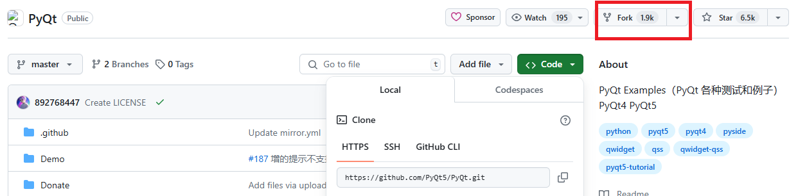
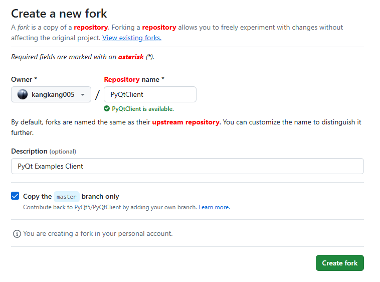
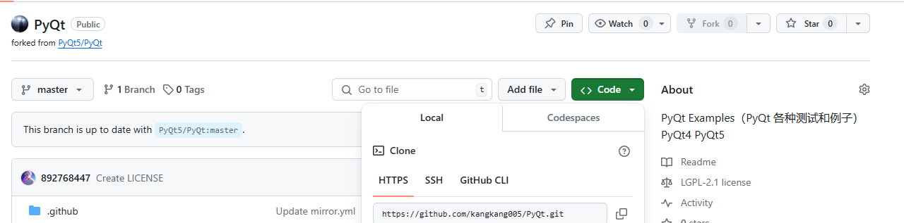

# Fork 别人的仓库成自己的仓库
## 1. Fork 概念
Fork 是 Git 和 GitHub 中一个常用的概念，它允许用户将一个代码仓库复制到自己的账户下，并在此基础上进行修改和扩展。Fork 的主要用途包括：

* 贡献代码：当你对某个开源项目感兴趣，希望为其贡献代码时，可以 Fork 该项目并进行修改、提交变更后再向原项目发起 Pull Request。
* 独立开发：当你希望基于已有的项目进行二次开发，但又不希望直接影响原项目时，可以 Fork 该项目作为自己的项目继续开发。如有原仓库有更新了，可以选择性的进行同步。
* 备份存档：当你需要备份一个代码仓库，或者希望保留某个特定时刻的代码状态时，可以 Fork 该项目并保留在自己的账户下。

## 2. Fork 别人的仓库并创建成自己的仓库
选择一个项目，点击`Fork`拷贝成自己的仓库。


按需修改仓库名称和描述，点击`Create Fork`。


已将别人的仓库`fork`成自己的仓库。


## 3. 已经将 Fork 项目克隆到本地
在你的本地命令行中，使用以下命令将 Fork 的项目克隆到本地:
```bash
git clone <forked_repository_url>
```
将 `<forked_repository_url>` 替换为你 Fork 后的项目的 URL 地址。克隆完成后，你就可以在本地进行进一步的开发和管理。

例如克隆 `fork` 别人项目的地址：
```bash
git clone https://github.com/PyQt5/PyQt.git
```
## 4. 将 Fork 的项目添加为远程仓库
为了方便与原项目进行同步，我们可以将原项目添加为 Fork 项目的上游远程仓库 (origin)，并命名为 `upstream`。使用以下命令添加上游仓库：
```bash
git remote add upstream <original_repository_url>
```
将 `<original_repository_url>` 替换为原项目的 URL 地址。

例如给自己项目的添加上游仓库：
```bash
git remote add upstream https://github.com/PyQt5/PyQt.git
```
添加成功后，使用以下命令可以查看远程仓库的列表：
```bash
git remote -v
```
远程仓库的列表:
```bash
>>> git remote -v
upstream        https://github.com/PyQt5/PyQt.git (fetch)
upstream        https://github.com/PyQt5/PyQt.git (push)
```

## 5. 与上游仓库同步（可选）
在进行项目开发的过程中，原项目可能会有新的提交或者变更。为了保持我们 Fork 项目的最新状态，我们需要定期与上游仓库进行同步。使用以下命令可以将上游仓库的最新代码拉取到本地：

从远程仓库获取最新的代码。
```bash
git fetch upstream
```
切换到自己的分支(可选)。
```bash
git checkout master
```
将别人的更新合并到你的当前分支。
```bash
git merge upstream/master
```
上述命令中，`upstream/master` 表示要拉取的远程上游仓库的 `master` 分支（也可能是其他名字），你需要根据实际情况进行调整。如果你的项目使用的是其他默认分支，也需要相应进行修改。

## 6. 将 Fork 的项目变成自己的独立项目
当你克隆了一个 Fork 项目后，你就可以将其变成自己的独立项目，并进行进一步的开发和管理。下面是一些常见的操作：
* 修改项目信息：可以修改项目的名称、描述等信息，使其更符合自己的要求。
* 添加新功能：可以基于原项目的基础上，添加自己的新功能和特性。
* 修复 Bug：可以修复原项目存在的 Bug，提高项目的稳定性。
* 发布版本：可以打标签、发布版本，对项目进行版本控制和发布管理。
* 添加文档：可以编写项目的文档、README 等，方便其他人了解和使用你的项目。

## 7. 推送修改
当你对 Fork 项目进行修改后，可以使用以下命令将修改推送到你的 Fork 仓库：
```bash
git add .
git commit -m "描述你的修改"
```
提交代码至自己项目。
```bash
git push origin master
```
上述命令中，`master` 表示要推送到的分支（也可能是其他名字），你需要根据实际情况进行调整。

## 8. 发起 Pull Request（可选）
当你想给原项目贡献代码，可以发起 `Pull Request`；如果只是作为学习的项目并不想合并到原项目，忽略此步骤。

完成修改并将其推送到 Fork 仓库后，你可以在 GitHub 上打开 Fork 仓库的页面，点击`New pull request`按钮，发起一次 Pull Request 给原项目。在 Pull Request 页面中，你可以描述你的修改内容和目的，并与项目的维护者进行讨论和交流。

## 9. 管理自己的 Fork 项目
作为一个独立的项目，你需要对自己的 Fork 项目进行管理和维护。以下是一些建议的管理操作：
* 解决冲突：在多人协作的项目中，可能会出现与其他人的修改冲突的情况。需要解决冲突并合并代码。
* 定期同步：定期与上游仓库同步，获取最新的代码变更。
* 处理 Issue：处理用户提交的 Bug 报告和功能请求，保持项目的健康发展。
* 社交互动：参与原项目的讨论、提问和回答，与项目的社区保持互动。
* 及时更新：及时更新项目的文档和 README，使其与项目的实际情况保持一致。

## 参考
https://geek-docs.com/git/git-questions/1826_git_github_make_fork_an_own_project.html