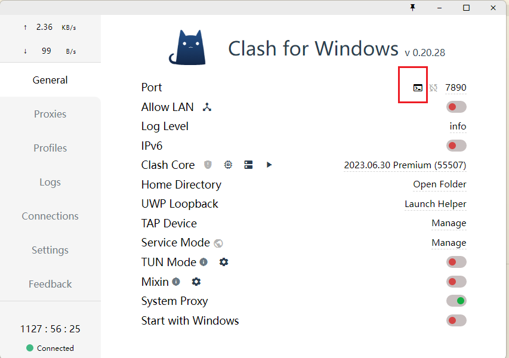
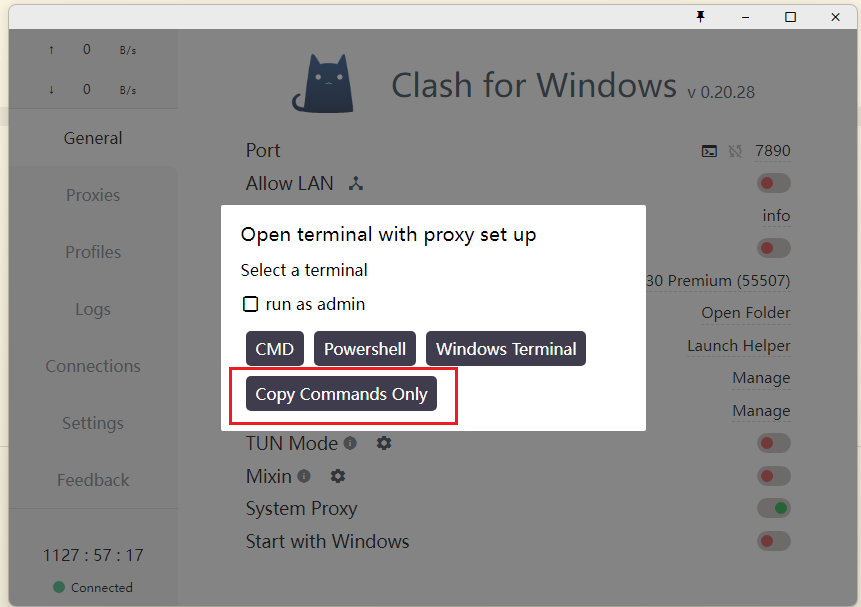
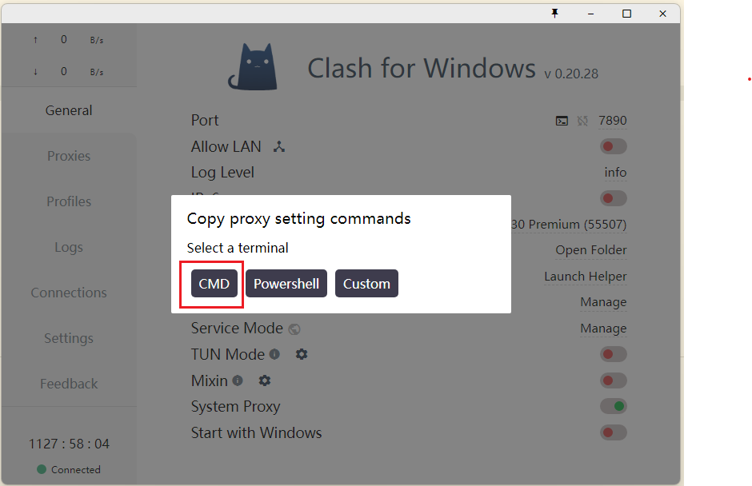
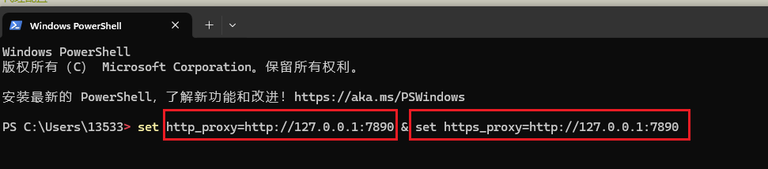

# 1. git pull 出现错误 error: Your local changes to the following files would be overwritten by merge
在使用 `git pull` 拉取代码的时候，会出现以下问题：


目前 git 的报错提示已经相关友好了，可以直观的发现，这里可以通过 `commit` 的方式解决这个冲突问题

## 方法一：stash
思路：通过 `git stash` 将工作区恢复到上次提交的内容，同时备份本地所做的修改，之后就可以正常 `git pull` 了，`git pull` 完成后，执行 `git stash pop` 将之前本地做的修改应用到当前工作区。

如果本地的修改重要。后续需要用到，那么可以把当前的修改暂存到堆栈区：

```bash
# 1. 备份当前的工作区的内容，让工作区保证和上次提交的内容一致。
#  同时，将当前的工作区内容保存到Git栈中。
git stash

# 查看stash内容
git stash list
```

拉取服务器上的代码:

```bash
# 2. 拉取服务器上的代码
git pull
```

要用到本地修改时，把 `stash` 内容应用到本地分支上：

```bash
# 3. 从Git栈中读取最近一次保存的内容，恢复工作区的相关内容。
git stash pop
```

`stash` 中的内容被弹出。如果保存了多个暂存内容，那么弹出顺序是先进后出的（栈）。

通过上面三步操作，就可以将服务器上的代码拉取下来了，同时本地修改的代码还存在，可以对他们进行修改操作，保留最终的代码即可。

```bash
# 4. 查看服务器代码和本地代码有哪些冲突
git diff
```


如果不想弹出内容，但仍然把 `stash` 内容应用到本地分支上：

```bash
git stash apply
```

这样 `stash` 中的内容不会被弹出。

此外，可以手动删除 `stash` 中的内容：

```bash
# 删除指定的一次stash内容，名称可以通过git stash list获得
git stash drop xxx
# 删除所有stash内容
git stash clear
```

注意：使用 `git stash` 暂存内容后 `merge`，再 `git stash pop`，可能报分支冲突，此时可以在本地新建一个分支，在新分支上恢复 `stash` 内容。

### 相关命令
| 命令            | 描述                                                                                                                                                    |
| --------------- | ------------------------------------------------------------------------------------------------------------------------------------------------------- |
| git stash       | 备份当前的工作区的内容，从最近的一次提交中读取相关内容，让工作区保证和上次提交的内容一致。同时，将当前的工作区内容保存到 Git 栈中。                     |
| git stash pop   | 从 Git 栈中读取最近一次保存的内容，恢复工作区的相关内容。由于可能存在多个 Stash 的内容，所以用栈来管理，`pop` 会从最近的一个 `stash` 中读取内容并恢复。 |
| git stash list  | 显示 Git 栈内的所有备份，可以利用这个列表来决定从那个地方恢复。                                                                                         |
| git stash clear | 清空 Git 栈。此时使用 gitg 等图形化工具会发现，原来 stash 的哪些节点都消失了。                                                                          |

## 方法二：放弃本地修改，直接覆盖（不推荐）
如果本地的修改不重要，那么可以直接把本地的的修改丢弃：

```bash
# 丢弃所有本地未提交的修改
git checkout .
```

有的本地文件是新添加但没有 `add` 过的，在 `git status` 中的状态是 `untrack`，它们需要通过 `git clean` 删除：

```bash
# 首先查看一下有哪些文件将被删除
git clean -nxdf

# 确定将被删除的文件无误后，执行删除
git clean -xdf

# 也可以一个一个文件的删除，比如删除文件xxx
git clean -f xxx
```

## 参考
https://blog.csdn.net/qq_41035283/article/details/124066316
https://www.cnblogs.com/nebie/p/10830838.html
https://blog.csdn.net/XH_jing/article/details/115367121

# 2. git pull 出现错误 error: he following untracked working tree files would be overwritten by merge
在使用 `git pull` 拉取代码的时候，会出现以下问题：


**问题**：git 本地未跟踪该文件, 而远程仓库已经跟踪该文件

**分析**: 问题出在 Error 所列出的文件在本地的当前分支下未授权给 git 追踪，但同样命名的文件，也即出现在另一个（远程）分支下的同一文件却正在远程仓库或其它分支被 git 进行追踪，接下来的操作（git merge/checkout …）使得 git 需要呈现的是远程或另一个分支下被追踪的同名文件，但 git 并不知道该如何处理当前状态下这些未被追踪的同名文件，请求你将它们移开或删除，从而在你想要进行的操作之后直接呈现这些文件在目标状态下的版本。

## 方法
如果想保留这些未追踪文件的变化, 将这些提醒撞名的文件添加到 git 的追踪当中，并利用 stash 将这些文件的状态进行存放备份，然后执行你本来想要执行的 git 命令 overwrite 这些文件。实现：

```bash
# 1. 利用 add 将这些文件进行追踪
git add [untracked files]
# 2. 利用 stash 暂存这些文件的状态 【注：stash 将暂存当前状态下所有未 push 的改变】
git stash
# 3. 执行你本来想要执行的命令 (git pull/merge/checkout ...)
git pull/merge/checkout
```

## 参考
https://blog.csdn.net/weixin_43958105/article/details/109728607

# 3. github 访问失败(git pull/git clone/git push)
当我们在向 GitHub 推送代码的时候，经常会遇到推不上去的情况，往往提示的是：

```bash
$ git push -u origin master
fatal: unable to access 'https://github.com/kangkang005/Vim.git/': Failed to connect to github.com port 443 after 21058 ms: Couldn't connect to server
```

大概率是 GitHub IP 无法访问导致的，通过设置代理可以解决此问题。

## 代理配置
有了 VPN 代理后，设置 git 命令的代理配置，有三种代理方式。

* 全局代理
* 本地代理，按项目设置代理
* 按源代理，按请求地址设置代理

### (1) 全局代理
通过 `git config --global` 可以设置全局代理，命令及示例如下：

```bash
# 设置代理，http 和 https 都加上代理，代理到 http://127.0.0.1:1087 这个 vpn 本地 IP, 查看 vpn 的代理 IP 看下一节内容（查看代理 IP 和端口）。
git config --global http.proxy http://127.0.0.1:1087
git config --global https.proxy http://127.0.0.1:1087

# 取消代理
git config --global --unset http.proxy
git config --global --unset https.proxy

# 查看代理
git config --global --get http.proxy
git config --global --get https.proxy

# 查看全局所有配置
git config --global --list
```

### (2) 本地代理
全局代理会将所有的 git 请求都使用这个代理，对于国内的或者公司内部的仓库，实际上是不需要的，加了反而拖慢速度。

故可以指定是 GitHub 的项目才走代理，其他的项目不走代理。

通过 `git config --local` 设置本项目代理，命令及示例如下：

```bash
# 设置代理
git config --local http.proxy http://127.0.0.1:1087
git config --local https.proxy http://127.0.0.1:1087

# 取消代理
git config --local --unset http.proxy
git config --local --unset https.proxy
```

### (3) 按源代理
本地代理的不方便之处是，每个需要代理的 GitHub 项目都需要手工配置一次，实在麻烦。

所以可以通过直接修改 git 全局配置文件的方式，指定哪些请求源走代理，不指定的就不走代理。

修改全局 `.gitconfig` 配置文件（一般在 `~/.gitconfig`），增加如下代理配置即可。

```bash
# 配置 http 代理
[http "https://github.com"]
  proxy = http://127.0.0.1:1087

# 配置 https 代理
[https "https://github.com"]
  proxy = http://127.0.0.1:1087
```

## 查看代理 IP 和端口
不同的 VPN 代理软件地址可能不一样，clash 可以通过以下途径查看：

进入 clash Dashboard, 点击 port 那一栏的 terminal 图标:



点击 `Copy Commands Only`:



选择其中一种类型的 command, 这里选择 `CMD`:



将 command 复制到任意位置查看代理 IP 和端口：



## 参考
https://segmentfault.com/a/1190000044607486

# 4. git pull origin master 出现错误： fatal: refusing to merge unrelated histories
在使用 Git 进行版本控制的过程中，你可能偶尔会遇到这样的错误信息：`fatal: refusing to merge unrelated histories`。这个看似棘手的问题实际上反映了 Git 的一种安全策略，旨在防止在没有共同历史的情况下合并两个独立的项目。本文将详细介绍这个问题产生的背景、原因，并提供几种有效的解决策略。
## 错误场景
1. 在本地新建仓库和添加文件：

```bash
mkdir test-demo
cd test-demo
git init
touch README.md
git add README.md
git commit -m "first commit"
```

2. 通过 `git remote add origin` 指定远程仓库地址：

```bash
git remote add origin https://github.com/<user>/<repo_name>.git
```

3. 提交代码后出现如下错误

```bash
$ git push origin master
To https://github.com/<user>/<repo_name>.git
 ! [rejected]        master -> master (non-fast-forward)
error: failed to push some refs to 'https://github.com/<user>/<repo_name>.git'
hint: Updates were rejected because the tip of your current branch is behind
hint: its remote counterpart. If you want to integrate the remote changes,
hint: use 'git pull' before pushing again.
hint: See the 'Note about fast-forwards' in 'git push --help' for details.
```

4. 由于无法提交，按照上面提示 `git pull ...` 进行操作：

```bash
$ git pull origin master
From https://github.com/<user>/<repo_name>
 * branch            master     -> FETCH_HEAD
fatal: refusing to merge unrelated histories
```

## 解决办法
使用 `--allow-unrelated-histories` 选项执行 `git pull` 命令。

```bash
# 拉取远程仓库
$ git pull origin master --allow-unrelated-histories
From https://github.com/<user>/<repo_name>
 * branch            master     -> FETCH_HEAD
Merge made by the 'ort' strategy.
 README.md | 38 ++++++++++++++++++++++++++++++++++++++
 1 file changed, 38 insertions(+)
 create mode 100644 README.md

# 提交到远程仓库
$ git push origin master
Enumerating objects: 16, done.
Counting objects: 100% (16/16), done.
Delta compression using up to 8 threads
Compressing objects: 100% (13/13), done.
Writing objects: 100% (15/15), 8.43 KiB | 2.81 MiB/s, done.
Total 15 (delta 0), reused 0 (delta 0), pack-reused 0
To https://github.com/<user>/<repo_name>.git
   0f4b2a4..d66bff9  master -> master
```

## 问题解释
当 Git 检测到你尝试合并的两个分支没有共享的提交历史时，就会报出 `fatal: refusing to merge unrelated histories` 的错误。这意味着 Git 无法找到一个共同的祖先节点来执行常规的合并操作。这种情形常见于以下几种场景：

1. 克隆一个全新的仓库并试图与现有仓库合并：如果你从 GitHub 或其他地方克隆了一个全新的项目，并打算将其合并到正在工作的本地仓库中，Git 会识别到两者历史上的断层，从而拒绝合并。

2. 合并两个长期独立发展的项目：如果你有两个长期独立发展且未曾合并过的历史，试图将它们合并也会遇到此问题。

## 解决方案
这样的错误在执行 `git pull`, `git push`, `git merge` 命令可能会遇到，这是因为两个分支没有取得关系，具体的操作是在你操作命令后面加 `--allow-unrelated-histories` 参数就可以了。

```bash
# git merge
git merge master --allow-unrelated-histories

# git pull
git pull origin master --allow-unrelated-histories

# git push
git push origin master
```

## 参考
https://segmentfault.com/a/1190000044807470