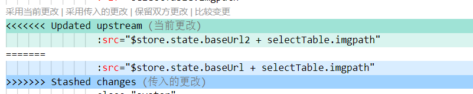

# 1. git pull 出现错误 error: Your local changes to the following files would be overwritten by merge
在使用 `git pull` 拉取代码的时候，会出现以下问题：


目前 git 的报错提示已经相关友好了，可以直观的发现，这里可以通过 `commit` 的方式解决这个冲突问题

## 方法一：stash
思路：通过 `git stash` 将工作区恢复到上次提交的内容，同时备份本地所做的修改，之后就可以正常 `git pull` 了，`git pull` 完成后，执行 `git stash pop` 将之前本地做的修改应用到当前工作区。

如果本地的修改重要。后续需要用到，那么可以把当前的修改暂存到堆栈区：

```bash
# 1. 备份当前的工作区的内容，让工作区保证和上次提交的内容一致。
#  同时，将当前的工作区内容保存到Git栈中。
git stash

# 查看stash内容
git stash list
```

拉取服务器上的代码:

```bash
# 2. 拉取服务器上的代码
git pull
```

要用到本地修改时，把 `stash` 内容应用到本地分支上：

```bash
# 3. 从Git栈中读取最近一次保存的内容，恢复工作区的相关内容。
git stash pop
```

`stash` 中的内容被弹出。如果保存了多个暂存内容，那么弹出顺序是先进后出的（栈）。

通过上面三步操作，就可以将服务器上的代码拉取下来了，同时本地修改的代码还存在，可以对他们进行修改操作，保留最终的代码即可。

```bash
# 4. 查看服务器代码和本地代码有哪些冲突
git diff
```




如果不想弹出内容，但仍然把 `stash` 内容应用到本地分支上：

```bash
git stash apply
```

这样 `stash` 中的内容不会被弹出。

此外，可以手动删除 `stash` 中的内容：

```bash
# 删除指定的一次stash内容，名称可以通过git stash list获得
git stash drop xxx
# 删除所有stash内容
git stash clear
```

注意：使用 `git stash` 暂存内容后 `merge`，再 `git stash pop`，可能报分支冲突，此时可以在本地新建一个分支，在新分支上恢复 `stash` 内容。

### 相关命令
| 命令            | 描述                                                                                                                                                    |
| --------------- | ------------------------------------------------------------------------------------------------------------------------------------------------------- |
| git stash       | 备份当前的工作区的内容，从最近的一次提交中读取相关内容，让工作区保证和上次提交的内容一致。同时，将当前的工作区内容保存到 Git 栈中。                     |
| git stash pop   | 从 Git 栈中读取最近一次保存的内容，恢复工作区的相关内容。由于可能存在多个 Stash 的内容，所以用栈来管理，`pop` 会从最近的一个 `stash` 中读取内容并恢复。 |
| git stash list  | 显示 Git 栈内的所有备份，可以利用这个列表来决定从那个地方恢复。                                                                                         |
| git stash clear | 清空 Git 栈。此时使用 gitg 等图形化工具会发现，原来 stash 的哪些节点都消失了。                                                                          |

## 方法二：放弃本地修改，直接覆盖（不推荐）
如果本地的修改不重要，那么可以直接把本地的的修改丢弃：

```bash
# 丢弃所有本地未提交的修改
git checkout .
```

有的本地文件是新添加但没有 `add` 过的，在 `git status` 中的状态是 `untrack`，它们需要通过 `git clean` 删除：

```bash
# 首先查看一下有哪些文件将被删除
git clean -nxdf

# 确定将被删除的文件无误后，执行删除
git clean -xdf

# 也可以一个一个文件的删除，比如删除文件xxx
git clean -f xxx
```

## 参考
https://blog.csdn.net/qq_41035283/article/details/124066316
https://www.cnblogs.com/nebie/p/10830838.html
https://blog.csdn.net/XH_jing/article/details/115367121

# 2. git pull 出现错误 error: he following untracked working tree files would be overwritten by merge
在使用 `git pull` 拉取代码的时候，会出现以下问题：


**问题**：git 本地未跟踪该文件, 而远程仓库已经跟踪该文件

**分析**: 问题出在 Error 所列出的文件在本地的当前分支下未授权给 git 追踪，但同样命名的文件，也即出现在另一个（远程）分支下的同一文件却正在远程仓库或其它分支被 git 进行追踪，接下来的操作（git merge/checkout …）使得 git 需要呈现的是远程或另一个分支下被追踪的同名文件，但 git 并不知道该如何处理当前状态下这些未被追踪的同名文件，请求你将它们移开或删除，从而在你想要进行的操作之后直接呈现这些文件在目标状态下的版本。

## 方法
如果想保留这些未追踪文件的变化, 将这些提醒撞名的文件添加到 git 的追踪当中，并利用 stash 将这些文件的状态进行存放备份，然后执行你本来想要执行的 git 命令 overwrite 这些文件。实现：

```bash
# 1. 利用 add 将这些文件进行追踪
git add [untracked files]
# 2. 利用 stash 暂存这些文件的状态 【注：stash 将暂存当前状态下所有未 push 的改变】
git stash
# 3. 执行你本来想要执行的命令 (git pull/merge/checkout ...)
git pull/merge/checkout
```

## 参考
https://blog.csdn.net/weixin_43958105/article/details/109728607