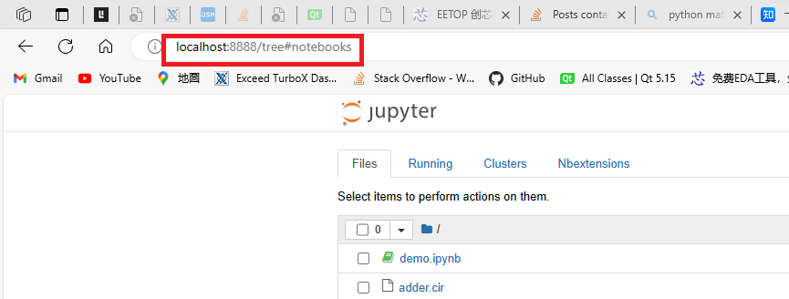
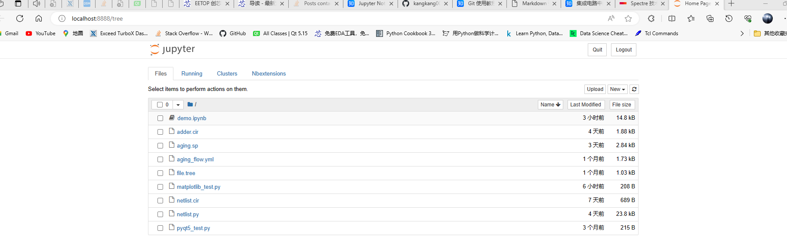
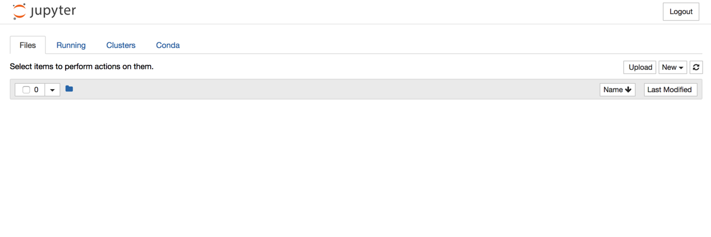

# 一、Jupyter Notebook
## 1. 介绍
Jupyter Notebook 是以网页的形式打开，可以在网页页面中直接编写代码和运行代码，代码的运行结果也会直接在代码块下显示的程序。
# 二、安装 Jupyter Notebook
## 1. 安装
### ① 安装前提
安装 Jupyter Notebook 的前提是需要安装了 Python（3.3 版本及以上，或 2.7 版本）。
### ② 使用 pip 命令安装
#### 1.更新pip
```
pip3 install --upgrade pip
```
#### 2.安装 Jupyter Notebook
```
pip3 install jupyter
```
# 三、运行 Jupyter Notebook
## 1. 启动
### ① 默认端口启动(默认8888)
```
jupyter notebook
```

注意：之后在 Jupyter Notebook 的所有操作，都请保持终端不要关闭，因为一旦关闭终端，就会断开与本地服务器的链接，无法在 Jupyter Notebook 中进行其他操作。

浏览器地址栏中默认地将会显示：http://localhost:8888。其中，“localhost” 指的是本机，“8888” 则是端口号。
如果你同时启动了多个 Jupyter Notebook，由于默认端口 “8888” 被占用，因此地址栏中的数字将从 “8888” 起，每多启动一个 Jupyter Notebook 数字就加 1，如 “8889”、“8890”…
### ② 指定端口启动
```
jupyter notebook --port <port_number>
```
其中，“<port_number>” 是自定义端口号，直接以数字的形式写在命令当中，数字两边不加尖括号 “<>”。如：`jupyter notebook --port 9999`，即在端口号为 “9999” 的服务器启动 Jupyter Notebook。
## 2. 主页面
### ① 主页面内容
浏览器显示jupyter的主页面

### ② 设置 Jupyter Notebook 文件存放位置
如果你不想把今后在 Jupyter Notebook 中编写的所有文档都直接保存在家目录下，那你需要修改 Jupyter Notebook 的文件存放路径。
#### (1) 创建并进入目录
```
mkdir <directory_name> ; cd <directory_name>
```
**注意**：“<directory_name>” 是自定义的目录名
#### (2) 配置文件路径
获取配置文件所在路径的命令
```
jupyter notebook --generate-config
```
**注意**： 这条命令虽然可以用于查看配置文件所在的路径，但主要用途是是否将这个路径下的配置文件**替换**为**默认配置文件**。 如果你是第一次查询，那么**或许**不会出现下图的提示；若文件已经存在或被修改，使用这个命令之后会出现询问 “Overwrite /Users/raxxie/.jupyter/jupyter_notebook_config.py with default config? [y/N]”，即 “用默认配置文件覆盖此路径下的文件吗？”，如果按 “y”，则完成覆盖，那么之前所做的修改都将失效；如果只是为了查询路径，那么一定要输入 “N”。
#### (3) 修改配置文件
##### (a) 打开配置文件
打开终端，输入命令：
```
vim ~/.jupyter/jupyter_notebook_config.py
```
##### (b) 查找关键词
搜索关键字**c.NotebookApp.notebook_dir**
```
## The directory to use for notebooks and kernels.
#  Default: ''
# c.NotebookApp.notebook_dir = ''
```
将**c.NotebookApp.notebook_dir**的赋值改为新目录，并取消注释。
```
## The directory to use for notebooks and kernels.
#  Default: ''
c.NotebookApp.notebook_dir = '~/jupyter_demo'
```
##### (c) 保存修改
保存修改并退出。
##### (d) 运行jupyter
运行jupyter，得到一个干净的页面。

# 四、Jupyter Notebook的基本使用
# 参考
https://zhuanlan.zhihu.com/p/33105153