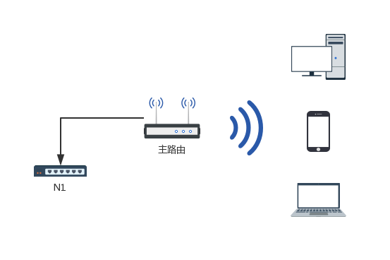
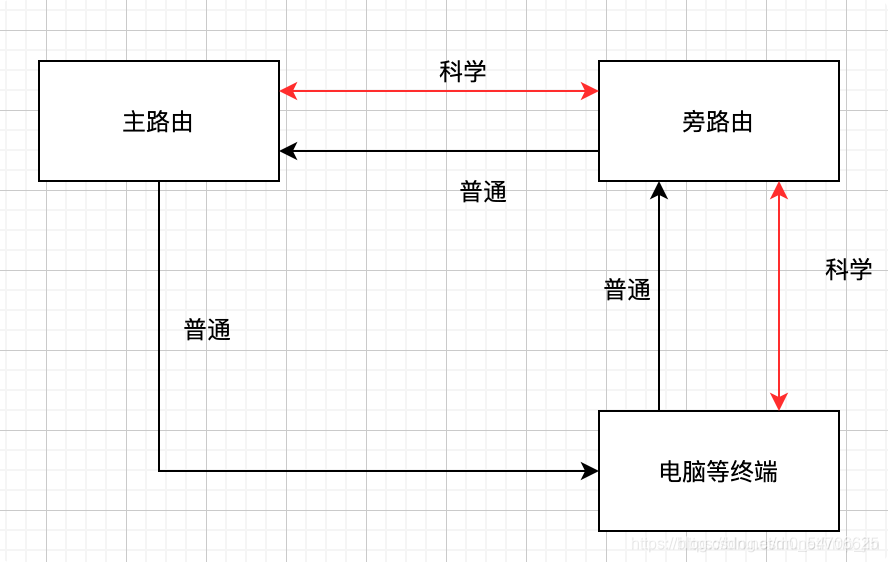

# 旁路由设置的三种方式



## 主路由与旁路由
首先默认主路由和旁路由为以下情况：

| 主路由：                | 旁路由：                |
| :---------------------- | :---------------------- |
| IP：192.168.11.1        | IP：192.168.1.1         |
| 子网掩码：255.255.255.0 | 子网掩码：默认          |
| 网关：默认              | 网关：默认              |
| 广播：默认              | 广播：默认              |
| 自定义 DNS 服务器：默认 | 自定义 DNS 服务器：默认 |

### 模式一（推荐）：主路由 开 DHCP + 旁路由 关 DHCP （非全局）
**主路由**无需做任何变动。

**旁路由**：

IPv4 地址修改为主路由网段中的一个地址，例如 `192.168.11.3`（与主路由同一网段但不同 IP: `192.168.11.x`）。

子网掩码设置与主路由相同，例如 `255.255.225.0`。

网关设置为主路由地址，例如 `192.168.11.1`。

DNS 地址根据本地网络情况设置，推荐设置为主路由 IP，例如 `192.168.11.1`。

**重要：若将 DNS 加速功能放在旁路由上，则统一将旁路由的 DNS 服务器设置为 127.0.0.1。**

同时下方「DHCP 服务器」，勾选「忽略此接口」。

保存并应用配置，然后将**旁路由**的 LAN 口连接到**主路由**的 LAN 口。

表现如下：

| 主路由：                | 旁路由：                        |
| :---------------------- | :------------------------------ |
| IP：192.168.11.1        | IP：192.168.11.3                |
| 子网掩码：255.255.255.0 | 子网掩码：255.255.255.0         |
| 网关：默认              | 网关：192.168.11.1              |
| 广播：默认              | 广播：默认                      |
| 自定义 DNS 服务器：默认 | 自定义 DNS 服务器：192.168.11.1 |

局域网内所有网络设备的设置(手机或者电脑等设备)，需要手动指定需要**旁路由**服务的设备，网关地址和 DNS 服务器为 `192.168.11.3`。

**这一条非常重要，不将网关设置为旁路由地址的话是没有办法使用像和谐上网、去广告等等插件功能的。**

> 说明：此设置方法是关闭旁路由(N1)的 DHCP 功能，完全由主路由的 DHCP 去分发地址，所以需要走旁路由转发网络的设备需要手动设置网关地址为旁路由的地址，如和谐上网、去广告等功能不将设备的网关设置为旁路由地址的话是无效的。
> 好处：不影响现有的网络环境，让旁路由去充当一个网关服务器（也就是旁路由）的角色，即使旁路由重启或者出现故障也不会影响局域网现有的其他设备。


普通流量只是上行经过旁路由转发一下，IP 不会改变；下行的时候主路由发现 IP 数据包是电脑，会直接发到电脑，无需再经过旁路由。

科学上网的流量都会经过旁路由。



### 模式二：主路由开 DHCP + 旁路由 关 DHCP (全局)
#### 方法一
**旁路由**的设置与模式一相同。

进入**主路由**，将主路由的 DHCP 的默认网关修改为旁路由的 IP，例如 `192.168.11.3`， DNS 服务器也修改为旁路由的 IP，例如 `192.168.11.3`。

#### 方法二（适用于主路由为 Openwrt）
**旁路由**的设置与模式一相同。

在**主路由**「DHCP 选项」中，添加两条参数，`3,192.168.11.3`，`6,192.168.11.3`（旁路由IP地址） 。

保存并应用配置即可。

表现如下：

| 主路由：                        | 旁路由：                        |
| :------------------------------ | :------------------------------ |
| IP：192.168.11.1                | IP：192.168.11.3                |
| 子网掩码：255.255.255.0         | 子网掩码：255.255.255.0         |
| 网关：192.168.11.3              | 网关：192.168.11.1              |
| 广播：默认                      | 广播：默认                      |
| 自定义 DNS 服务器：192.168.11.3 | 自定义 DNS 服务器：192.168.11.1 |

### 模式三：主路由不开 DHCP+ 旁路由 开 DHCP (全局)
**主路由**关闭 DHCP，然后设置网关为旁路由的 IP，例如 `192.168.11.3`， DNS 服务器也修改为旁路由的 IP，例如 `192.168.11.3`。

**旁路由**设置网关为主路由的 IP，例如 `192.168.11.1`。

**可选：旁路由设置 DNS 服务器为主路由的 IP，例如 `192.168.11.1`。**

表现如下：

| 主路由：                        | 旁路由：                                     |
| :------------------------------ | :------------------------------------------- |
| IP：192.168.11.1                | IP：192.168.11.3                             |
| 子网掩码：255.255.255.0         | 子网掩码：255.255.255.0                      |
| 网关：192.168.11.3              | 网关：192.168.11.1                           |
| 广播：默认                      | 广播：默认                                   |
| 自定义 DNS 服务器：192.168.11.3 | 自定义 DNS 服务器：默认（或者 192.168.11.1） |

## 附一： N1 盒子旁路由需要在防火墙自定义规则添加
有些路由器这么配置，国内流量是无法上网的，只有国外的没问题，必须要配置一条防火墙规则。老版的 OpenWRT 具体设置如下：

回到菜单栏点击: **网络** > **防火墙** > **自定义规则**。

在自定义规则里填加这一条规则:

```bash
iptables -t nat -I POSTROUTING -o eth0 -j MASQUERADE
```

然后点击最下方 **重启防火墙**即可。

新版的 OpenWRT 打个 `√` 就可以了。

## 转载与参考
https://oeone.cn/archives/486.html
https://www.right.com.cn/FORUM/thread-4181997-1-1.html
https://sspai.com/post/59708#!
https://www.wyr.me/post/625
https://blog.csdn.net/m0_54706625/article/details/116430697
https://asukahan.github.io/2020/04/08/%E6%96%90%E8%AE%AFN1/
https://www.cnblogs.com/robotpaul/p/17127387.html