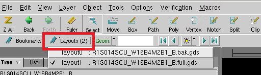

## calibredrv
### 同时打开多个 GDS 文件，并在此会话里边带入版层描述信息
```
calibredrv -individual -dl tech.layerprops -m $GDS1 -m $GDS2
```
在工具栏中的layouts切换gds

* 这里需要注意的是选项 -individual，默认 calibredrv 是以 merge（合并）模式打开
使用 calibedrv 同时打开版图文件和 RVE GUI 打开对应的 DRC DB
* calibredrv -dl tech.layerprops -m $GDS -rve -drc DRC.db
这个时候，GUI 的结果会有一些不同，用户可以看到两个窗口，一个是 DRV，另外一个就是 RVE
### 只读模式打开gds
```
calibredrv -noedit -m $GDS
```
Edit 下拉菜单完全是灰色的，这就是在 calibredrv 禁止编辑的状态
## Calibre
### -turbo
```
calibre -turbo <CPU-number>
```
多核跑calibre, 增加 cpu 并行，提高运行速度。
### query_cmd
```
Running the Calibre Query Server for Output to
Star-RCXT
This section discusses the various Calibre query server commands required to generate
proper Calibre Connectivity Interface files for Star-RCXT. The following commands should
be listed in the query server command file that is provided to the calibre -query svdb
command.


[b]LAYOUT NETLIST DEVICE LOCATION CENTER
#Instructs query server to write net ID to seed polygons
GDS SEED PROPERTY ORIGINAL
#Generates the GDS_MAP layer file.
RESPONSE FILE GDS_MAP
GDS MAP
RESPONSE DIRECT
#The following line defines the property numbers for net
#names and instance #names. Star-RCXT expects the NETPROP
#number to be 5, the PLACEPROP number to #be 6, and INSTPROP
#number to be 7 so these cannot be changed.
GDS NETPROP NUMBER 5
GDS PLACEPROP NUMBER 6
GDS DEVPROP NUMBER 7
#Outputs Calibre AGF file for Star-RCXT.
GDS WRITE agf
#These commands ensure pin co-ordinates and proper hierarchy
#in the ideal layout netlist written out by Calibre.
LAYOUT NETLIST TRIVIAL PINS YES
LAYOUT NETLIST EMPTY CELLS YES
LAYOUT NETLIST NAMES NONE
LAYOUT NETLIST PRIMITIVE DEVICE SUBCKTS NO
LAYOUT NETLIST PIN LOCATIONS YES
LAYOUT NETLIST HIERARCHY AGF
LAYOUT NETLIST WRITE nl
#Outputs Calibre ideal layout name map for Star-RCXT.
LAYOUT NAMETABLE WRITE lnn
```
## 参考
https://zhuanlan.zhihu.com/p/585652864