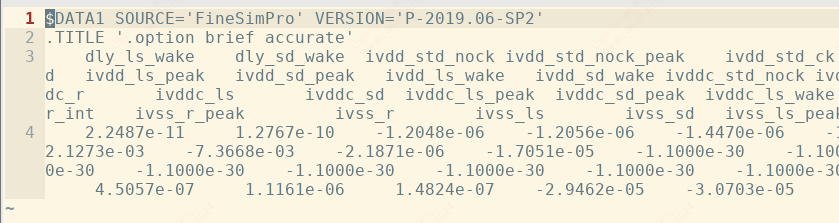
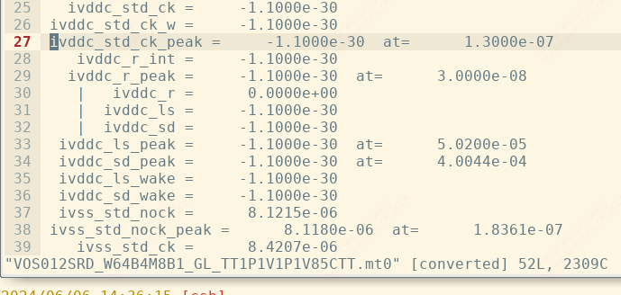
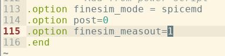

# mt0 数据排版
## 设置
跑 FineSim 时可以通过设置来 `.option finesim_measout` 修改数据输出的格式，默认 `.option finesim_measout=0`.

测量名称占一行，测量值占一行.

`.option finesim_measout=1` 则是测量名称占一列，测量值占一列.

在 testbench 中的设置：

## 参考
https://blog.eetop.cn/blog-1615674-6952858.html