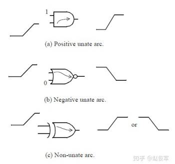

# STA
静态时序分析：通过为 synthesis 计算 cell 和 net 组成的 path 的延时，判断 path 延时是否满足相应时序约束，然后基于 path 延时，工具从 timing library 中选择 cells 来创建一个满足 timing 要求的电路。之所以称为静态时序分析，是由于没有输入激励文件。
STA 的优点是运算速度快，缺点是不能进行功能验证，并且会报出一些 false 的错误。

# Timing library
Timing library 通常指包含 timing, power, noise, function 信息的 logic library。Timing library 为 STA 提供 cells 和 nets 的延时信息。 Timing arcs 用来体现 cells 和 nets 的延时信息。工具通过不同的 PVT (process voltage temperature) 工作条件下，得到对应的时序信息。目前广泛使用的格式是 library，以.lib 作为扩展名。
Timing arcs 中包含的 unateness、slew 和 delay 特性都可以从 timing library 中查到。
## 1.Unateness
表示信号的翻转和输入的关系，信号从 1 到 1 就是 positive unate，从 1 到 0 就是 negative unate，无关就是 nonunate。
```
pin(Y) {
    timing() {
        ...
        related_pin : "A";
        timing_sense : positive_unate;
        timing_type : combinational;
    }
}
```


## 2.Slew
指信号电平翻转的速度，即从 1 变 0 或从 0 变 1 的翻转速度，即是指信号的翻转率，通常 slew=constant/(transition time)。

transition time 是指信号从高电平转化到低电平或者低电平转化到高电平所花费的时间。Transition time 的长短和输入信号 input transition 以及 output 的 load 有关。上升和下降 transition 时间都是 timing arc 的特性，输入信号和输出信号都有上升和下降的 transition 时间。STA 工具是通过 slew 的阈值来计算输入的 transition 时间。

Slew 的阈值可以在 timing library 中定义，输入的上升和下降时间是通过 slew 的阈值来计算的。 代码 lib 中的 index_1 是指 input transition 时间，index_2 是指 output load 值。
```
pin(Y) {
    timing() {
        ...
        fall_transition(tmg_ntin_oload_7x7) {
            index_1 ("0.00222, 0.01621, 0.06641, 0.16180");
            index_2 ("0.0001, 0.015552, 0.06981, 0.17339");
            value (
                "0.0101859, 0.023706, 0.0726713, 0.167073",
                "0.0101859, 0.023706, 0.0726713, 0.167073",
                "0.0101859, 0.023706, 0.0726713, 0.167073",
                "0.0101859, 0.023706, 0.0726713, 0.167073",
            )
        }
        rise_transition(tmg_ntin_oload_7x7) {
            index_1 ("...");
            index_2 ("...");
            value ("...")
        }
        ...
    }
}
```
## 3.Delay
Delay 分为 cell delay 和 net delay，cell delay 指信号从输入到输出的时间。Net delay 指信号从 net 的起始点到终点的时间。

Cell delay：Cell 中的晶体管需要一定的时间来开关，因此 cell 的 input 的改变需要一定的时间才能使得 output 改变。

Net delay：Net 延时是指信号刚传到 net 上到信号到达这条 net 的 loads 的时间。