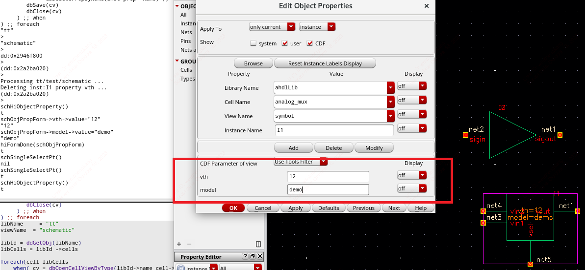

## 列表
https://blog.eetop.cn/home.php?mod=space&uid=1786898&do=blog&id=6950164
### listp()
判断是否是list。
```
listp('(1 2 3))
=> t
listp(nil)
=> t
listp(1)
=> nil
```
### list()
用来创建一个 List 数据类型的变量，也可用单引号 '。例如：
```
aList='(1 2 a b c)
bList=list(1 2 'a 'b 'c)
cList='(1 (2 a b) c)
```
**注**：当有字符出现的时候，用 list () 函数创建必须在字符前加单引号
### length()
获取 list 元素个数。
```
lst='(1 2 a b c)
length(lst)
=> 5
```
### car()
用来读取 List 中的第一个元素。例如：
```
car('(a b c))
=>a
```
### cdr()
用来读取 List 中除了第一个元素外后面的单元。例如：
```
cdr('(a b c))
=>(b c)
```
此外，可以对 List 重复混合使用 car 或 cdr 函数，组合的格式为以 c 开头，r 结尾，中间可有多个 a|d。例如：
caadr 功能等同于 car (car (cdr (List))),caadr () 函数对 List 的操作顺序为：
(1) 先执行一次 cdr，读取后面的单元；
(2) 对第一步读取的值执行 car，读取其第一元素；
(2) 对第二步读取的值执行 car，读取其第一元素。
```
caadr('((1 2 3) (4 5 6) (7 8 9)))
=>4
```
### nthelem()
按元素序号读取 List 中的元素，起始元素的序号为1用法：
nthelem(1 1_list) 等同于 car(1_list)
### nth()
按元素序号读取 List 中的元素，起始元素的序号为0用法：
### last()
用来读取 List 中的最后一个元素。其数据类型也是一个 List。用法：
```
last(listname)
```
### rplaca()
用来替换 List 中的第一个元素。例如：
```
aList='(1 2 3)
bList=rplaca(aList 4)
aList
=>(4 2 3)
eq(aList bList)
=>t
```
同理用 rplacd () 函数可以替换 List 后面的单元。
### cons()
用来添加元素到 List 之前。例如：
```
aList='(2 3 4)
cons(1 aList)
=>(1 2 3 4)
```
此外，xcons () 函数和 cons () 函数功能一样，只是格式有所区别，前面的变量为原 List 的元素，后面的变量为需要添加的元素。例如：
```
xcons('(b c) 'a)
=>(a b c)
```
### append1()
用来添加元素到 List 之后。例如：
```
append1('(1 2 3) 4)
=>(1 2 3 4)
```
### append() 与 nconc()
两个函数都是用来合并两个 List。前者不改变所合并的 List 变量的值；后者会改变所合并 List 的值，且依次累加，最后一个 List 值不变。例如：
```
cList='(1 2) dList='(3 4 5) eList='(6 7)
append(cList dList)
=>(1 2 3 4 5)
cList
=>(1 2)
dList
=>(3 4 5)

nconc(cList dList eList)
=>(1 2 3 4 5 6 7)
cList
=>(1 2 3 4 5 6 7)
dList
=>(3 4 5 6 7)
eList
=>(6 7)
```
### reverse()
用于元素倒序排序。例如：
```
aList='(1 2 3)
reverse(aList)
=>(3 2 1)
bList='(1 2 (3 4 5) 6)
reverse(bList)
=>(6 (3 4 5) 2 1)
bList
=>(1 2 (3 4 5) 6)
```
### sort()
用于元素按条件排序。书写格式为：
```
sort(1_data u_comparefn)
```
其中第一个变量 “1_data” 为 List 的变量，第二个变量 “u_comparefn” 为对比函数。对比函数也可以是自定义函数。例如：
```
sort('(4 3 2 1) 'lessp)
=>(1 2 3 4)
sort('(d b c a) 'alphalessp)
=>(a b c d)
sort('("U5" "U10" "U1" "U5" "U2") 'axlStrcmpAlpNum)
=>("U1" "U2" "U5" "U5" "U10")  （其中 “axlStrcmpAlpNum” 为自定义函数）
```
此外，当 List 元素都是由 List 组成的时候，可以使用 sortcar () 函数来对比子 List 的第一个元素排序。例如：
```
sortcar('((4 four) (3 three) (2 two)) 'lessp)
=>((2 two) (3 three) (4 four))
sortcar('((d 4) (b 2) (c 3) (a 1)) 'nil)
=>((a 1) (b 2) (c 3) (d 4))
```
### member() 与 assoc()
member () 函数是一种用于查找 List 元素的函数。它从 List 的第一个元素开始查找，找到并返回第一个元素后继续找，一直到最后。如果能找到，返回从找到的元素开始直到最后的元素，找不到则返回 nil。因此可以用来判断元素是否存在。例如：
```
member(3 '(2 3 4 3 5))
=>(3 4 3 5)
member(6 '(2 3 4 3 5))
=>nil
```
assoc () 函数也是一种用于查找 List 元素的函数，其书写格式为：
```
assoc(g_key l_alist)
```
其中 “g_key” 变量为所查找的第一个完整的关键值，“l_alist” 是个由多个 List 组成的 List，格式为：((key1 value1) (key2 value2) (key3 value3)......)。
assoc () 函数返回的是查找到的子 List。例如：
```
aList='((1 "one") (2 "two") (3 "three"))
assoc(2 aList)
=>(2 "two")
assoc("one" aList)
=>nil
```
### setof()、exists() 与 forall()
这三种函数都是用于过滤 List 元素的函数。
setof () 函数的书写格式为：
```
setof(s_formalVar l_valueList g_predicateExpression)。
```
其中 “s_formalVar” 变量为局部变量，作用于 “g_predicateExpression” 表达式中，“l_valueList” 变量为要过滤的 List 变量，“g_predicateExpression” 为自定义表达式。例如：
```
setof(x '(1 2 3 4) (x>2))
=>(3 4)
setof(x '(1 2 3 4 5 6) oddp(x))
=>(1 3 5)  （oddp () 函数是将一个不是奇数的数值舍入为最接近的奇数）
```
exists () 函数和 setof () 函数的区别在于 exists () 函数查找 List 中满足条件的第一个元素，并返回之后的所有元素。例如：
```
exists(x '(4 3 4 5) (x<4))
=>(3 4 5)
```
forall () 函数用于判断 List 中所有的元素是否全部满足表达式，全满足返回 t，否则返回 nil。例如：
```
forall(x '(1 2 3 4) (x>0))
=>t
forall(x '(2 4 7 8) evenp(x))
=>nil  （evenp () 函数是返回沿绝对值增大方向取整后最接近的偶数）
```
### remove()
用来移除 List 中所指定的元素。如果 List 中没有所指定的元素，则返回原 List。remove () 函数不会改变原 List 变量的值。例如：
aList='(1 2 3 4 5)
```
remove(3 aList)
=>(1 2 4 5)
aList
=>(1 2 3 4 5)
```
### mapcar()
连续依次操作 List 集合中每个子 List 的元素，首先把每个 List 中的第一个元素当作 function 的形参，然后是每个 List 的第二个元素，一直到最短的 List 的最后一个元素。剩下的元素将被忽略。它的结果是返回一个 List 集合的元素依次应用于 function 的结果。例如：
```
mapcar('plus '(1 2 3) '(8 7 6))
=>(9 9 9)
mapcar('list '(a b c) '(1 2 3) '(x y z))
=>((a 1 x) (b 2 y) (c 3 z))
mapcar('lambda((x) plus(x 1)) '(2 4 6))
=>(3 5 7)  （“lambda” 为匿名函数）
```
**拓展：**
mapc () 函数与 mapcar () 函数类似，只是返回的是参数的第一个 List，并没有聚集的结果，故它比 mapcar () 函数快。例如：
```
mapc('lambda((x) plus(x 1)) '(2 4 6))
=>(2 4 6)
```
map () 函数对遍历处理每一个子 List 很有用，它用的是 cdr () 函数的方式，忽略每次运行的结果，返回原始的 List。例如：
```
map('list '(1 2 3) '(9 8 7))
=>(1 2 3)
```
### maplist()
和 mapcar () 函数类似，不过 maplist () 函数是首先将函数 apply 到每个 List 参数下。即函数首先应用于整个 List，然后将函数应用到每个 List 的 cdr，再将函数应用到每个 List 的 cddr，一直到最短的一个 List 为空为止。例如：
```
maplist('length '(1 2 3))
=>(3 2 1)  （length () 函数用于计算一个 list 或者 array 的长度）
maplist('list '(a b c) '(1 2 3))
=>(((a b c) (1 2 3)) ((b c) (2 3)) ((c) (3)))
```
此外还有 mapl () 函数。mapl 对于 maplist 正如 mapc 对应于 mapcar。
### mapcan()
遍历收集每次运行的结果存放在一个新的 List 中，可用于 List 的重组。例如：
```
mapcan('list '(1 2 3) '(a b c))
=>(1 a 2 b 3 c)
foreach(mapcan x '((1 2) (3 4 5) (6 7)) x)
=>(1 2 3 4 5 6 7)
```
### removeListDuplicates()
从list中删除重复的元素。
```
lst = list(1, 2, 1, 2)
removeListDuplicates(lst)
=> (1 2)
```
### parseString()
字符串转换为列表结构，默认以空格分隔。
```
parseString("Now is the time")
=> ("Now" "is" "the" "time")
parseString("feed" "e")
=> ("f" "d")
parseString("-abc-def--ghi-" "-")
=> ("abc" "def" "ghi")
parseString("-abc-def--ghi-" "-" t)
=> ("" "abc" "def" "" "ghi" "")
```
### member()
list 中是否含有某元素，如果存在则返回从该元素到最后元素的list，否则返回nil。
```
member("c" '("a" "b" "c" "d" "c" "d"))
=> ("c" "d" "c" "d")
```

## 内置函数
### ddGetStartup()
获得项目的路径。
```
ddGetStartup("cds.lib")
=> /home/wei/cadence/cds.lib
```
### dbGetNameNumBit()
根据 bus 命名中 获得net 数量。
```
dbGetNameNumBit("net<2:0>")
=> 3
```
### dbProduceMemName()
将 bus 命名 flatten。
```
dbProduceMemName( "net<2:0>" )
=> ("net<2>" "net<1>" "net<0>")
```
### cdfParseFloatString()
将字符串语义上所描述的数字转成科学计数形式。
```
cdfParseFloatString("12u")
=> 1.2e-05
```

## 文件
### 读文件操作
```
let(
    (in_port file_line)
    in_port = infile("~/.bashrc")
    when( in_port
        while( gets(file_line in_port)
            println( file_line )
        );while
    close(in_port)
    );when
);let
```
**函数：**
**infile** 以读入的方式打开文件
**gets**  函数获取文件中一行数据并保存在变量中
**close** 函数关闭文件
**println** 函数按数据原有格式输出内容，并在内容后面加上换行符
### 写文件操作
```
let(
    (out_port)
    out_port = outfile("~/Desktop/file_write.txt")
    for( i 1 5
        fprintf( out_port "This is line: %d \n" i)
    );for
    close(out_port)
);let
```
**函数:**
**outfile** 以写入的方式打开文件
**fprintf** 将需要写入的内容格式化输入到打开的文件内

## 常用函数
### ~>?
查询已存在属性名。
```
cv=geGetSelSet()~>?
=> ((cellView objType prop bBox children
    groupNumbers isAnyInst isShape matchPoints net
    ...
))
```
### ~>??
查询已存在属性名和属性值。
```
cv=geGetSelSet()~>??
=> ((db:0x226cd41a cellview db:0x226cdb9a objType "inst"
    prop nil ...
))
```
### geGetSelSet()
获得选中的对象的ID, 返回列表。
```
cv=geGetSelSet()
=> (db:0x226cb41b 0x226cb41c)
# 获得cell名字
geGetSelSet()~>cellName
=> ("analog_mux" "amp")
```
### dbOpenCellViewByType()
打开cellview对象，返回ID对象。
```
# 获取cellview对象
dbOpenCellViewByType("functional" "adder" "symbol" "" "r")
=> db:0x226cb41b
# 获取cellview schematic所有实体对象
dbOpenCellViewByType("tt" "circuit_demo" "schematic" "" "r")~>instances
=> (db:0x226cb41b, db:0x226cb41e)
```
### geGetWindowCellView()
获得CellView窗口的ID对象。
```
geGetWindowCellView()
=> db:0x226cb41b
#获得全部实体对象的ID。
geGetWindowCellView()~>instances
=> (db:0x226cb41b 0x226cb41c)
```
### geSelectFigs()
选中指定对象。
```
# 选中窗口中所有器件
geSelectFigs(geGetWindowCellView()~>instances)
```
### ddGetobj()
获得库、器件、文件等对象。
```
# 获得库对象
ddGetobj("functional")
=> db:0x226cb41b
# 获得库中器件对象
ddGetobj("functional", "adder")
=> db:0x22678b0
# 获得库中所有器件对象的名字
ddGetobj("functional")~>cells~>name
=> ("pole", "adder", "opAmp", "zero" ...)
```
### cdfGetInstCDF()
获取器件的CDF数据对象。
```
# 获取器件的CDF对象
cdf = cdfGetInstCDF(car(geGetWindowCellView()~>instances))
=> db:0x22678b0
# 获取器件的CDF属性名称
cdfGetInstCDF(car(geGetWindowCellView()~>instances))~>parameters~>name
=> ("gain", "sign_offset", "model")
# 获取器件的CDF属性值
cdfGetInstCDF(car(geGetWindowCellView()~>instances))~>parameters~>value
=> ("", "", "")
```
### cdfFindParamByName()
获得特定的Param ID对象，不存在该Param ID则返回nil。
```
# 获得Param的属性值
cdfFindParamByName(cdfGetInstCDF(car(geGetWindowCellView()~>instances)), "m")~>value
=> ""
```
### dbDeleteObject()
删除对象，删除成功返回t，否则返回nil。
```
# 删除所选对象
dbDeleteObject(car(geGetSelSet()))
```
### schCheck()
检查cellview是否报错。
```
# 检查当前cellview
cv=hiGetCurrentWindow()~>cellView
...
schCheck(cv)
```
### dbSave()
保存cellview。
```
# 检查并保存当前cellview
cv=hiGetCurrentWindow()~>cellView
...
schCheck(cv)
dbSave(cv)
```
### dbDeletePropByName()
删除property属性值。
```
# 删除所选instance的vth属性值
dbDeletePropByName(car(geGetSelSet()), "vth")
```
### fboundp()
查询函数是否定义，未定义则返回nil。
```
fboundp('cadr)
=> lambda:cadr
fboundp('list)
=> lambda:list
fboundp('xyz)
=> nil
```
## UI
### hiDisplayAppDBox()
简单弹出一个对话框 DBox
```
hiDisplayAppDBox(
    ?name 'TipsForm
    ?dboxBanner "Warning"
    ?buttonLayout 'Close
    ?dboxText "test"
)
```

### hiDisplayModelessDBox()
更加简单地弹出一个 DBox
## 需求
### 获取所选instance的pin脚名字
```
# method:1
car(geGetSelSet())~>instTerms~>term~>pins~>name
=> (("vin1")
        ("vin2")
        ("vout")
        ("vsel")
)
# method:2
car(geGetSelSet())~>instTerms~>term~>net~>name
=> ("vin1" "vin2" "vout" "vsel")
```
### 获取所选instance的property名字
在edit property弹窗中修改property属性，返回所有property属性名。如果edit property弹窗中property的属性全部为空，则返回nil。
```
car(geGetSelSet())~>prop~>name
=> ("vth")
```

```
car(geGetSelSet())~>prop~>name
=> nil
```

### 删除所有属性值
```
libName   = "tt" # Tell_Me_Your_Lib_Name_Here
viewName  = "schematic" # Tell_Me_Which_View_To_Process

libId = ddGetObj(libName)
libCells = libId ->cells

foreach(cell libCells
    when( cv = dbOpenCellViewByType(libId->name cell->name viewName "" "a")
        printf("Processing %s/%s/%s ...\n" libId->name cell->name viewName)
        insts = cv-> instances
        foreach(inst insts
           props = inst->prop
           foreach(prop props  printf("Deleting inst:%s property %s ...\n" inst->name prop->name)
              dbDeletePropByName(inst prop->name) ))
        dbSave(cv)
        dbClose(cv)
     ) ;; when
) ;; foreach
```
* before

* after

## 问题
### master属性指的是什么
```
# 返回top cellView ID
dbOpenCellViewByType("tt" "circuit_demo" "schematic" "" "r")~>objType
=> "cellView"
# 返回器件的instance ID
dbOpenCellViewByType("tt" "circuit_demo" "schematic" "" "r")~>instances~>objType
=> ("inst" "inst")
# 返回器件的cellview ID，相当于进入instance的cellview窗口
dbOpenCellViewByType("tt" "circuit_demo" "schematic" "" "r")~>instances~>master~>objType
=> ("cellView" "cellView")
```


### master 与 instanceMasters 区别
```
cv = dbOpenCellViewByType("tt" "circuit_demo" "schematic" "" "r")
cv~>instances~>master
=> (db:xxxxxx db:xxxxxx)
```
等同于
```
cv = dbOpenCellViewByType("tt" "circuit_demo" "schematic" "" "r")
cv~>instanceMasters
=> (db:xxxxxx db:xxxxxx)
```
### libName cellName and viewName
```
cv~>instances~>master~>cellName
=> ("amp" "analog_mux" "idc")
cv~>instances~>master~>libName
=> ("ahdlLib" "ahdlLib" "ahdlLib")
cv~>instances~>master~>viewName
=> ("symbol" "symbol" "symbol")
```
## API前缀
|Prefix | Description |
|----|----|
|le | Layout Edit(GUI) |
|sch | schematic(GUI) |
|hi | GUI |
|db | database(None GUI) |
|dd | |
|pte | Palette， 包括LSW/Objects/Grids等|
|cdf | CDF(Component Description Format) |
---

## 注意
https://blog.eetop.cn/blog-1602867-6944034.html
1. skill 使用 t 和 nil 两个单词表示 真假。
2. skill 里的字串或者集合用 list 表示，字串的定义用 list 来声明或者用一个符号 ' 来声明，二者部分情况下是通用的，但是有时候还是不同的，这个大家就要看语法了。对于 list 字串或者集合来说，有很多现成的函数，譬如计算这个字串包含元素的个数，合并字串，找到第 n 个元素。
3. 注意使用基本的关系运算符和逻辑运算符
4. 注意 if，when，unless，case，cond，for，foreach 几个经常用的函数的使用方法
5. 注意 print，println，printf 几个函数的使用方法，尤其是格式化输出 printf，对于只学习了 C++ 而没有学习 c 的朋友可能要费点心看一下了。
6. 注意怎样用 fprint 和 gets，fscanf 写入和读取文件内容
7. 用 procedure 定义函数的方法，其中 @reset ，@optional， @key 几种决定参数传递的方式有什么不同。
8. 用 let 和 prog 定义局部变量的方式以及二者的不同
9. 知道一些常用的函数如 abs，round，sqrt，random，zerop 是什么含义，返回值是什么类型。
## 如何学习
https://bbs.eetop.cn/thread-883222-1-1.html
IC617 里面的几个有用的文档，可在安装目录下的 doc 目录里面找到：
**sklanguser** - SKILL 语言的用户指南，入门必读。但是这东西只会教你怎么用 SKILL 语言本身，不会教你怎么调用 Cadence 的工具。
**sklangref** - SKILL 语言的参考手册。语言本身的问题都可以在参考手册中找到。
**skdfref** - 如何使用 SKILL 调用 Cadence 数据库的手册，主要是版图数据库。如果你想直接改你的 cell 的话，本质上就是改这个 cell 的数据库，不用打开图形界面就可以修改。虽然名字带 ref，但是它也像用户指南一样做一些基本的说明。
**sklayoutref** - 如何用 SKILL 调用 Cadence 版图界面的手册。注意，它需要打开版图界面才能使用。
**skcompref** - 如何用 SKILL 调用 Cadence 原理图界面和数据库的手册。
## 参考
* Skill脚本处理CDF属性值callback https://bbs.eetop.cn/thread-848719-1-1.html
* hierarchy修改cdf参数 https://bbs.eetop.cn/thread-702837-1-1.html
* 怎么将自己弄的 skill 程序集成到 virtuoso 的菜单上啊 https://bbs.eetop.cn/thread-603763-1-1.html