# Cadence virtuoso导入tsmc18rf工艺库
## 1.准备
tsmc18rf工艺库安装包：**tsmc18rf_pdk_v13d.tar** （CDS格式）
压缩包包含以下的文件（7个文件）：
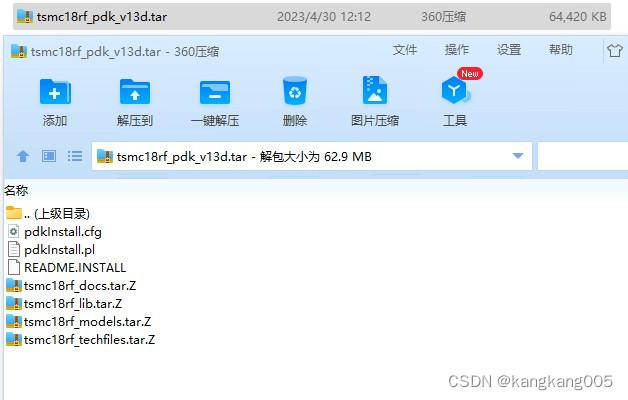
## 2.安装
1：在/home/<用户名>/的目录下新建cadence/目录，全部安装操作均在该目录下进行。
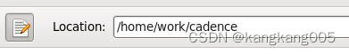
2：在/home/<用户名>/cadence/目录下新建四个目录（OA, PDK, pro, tar_pak）
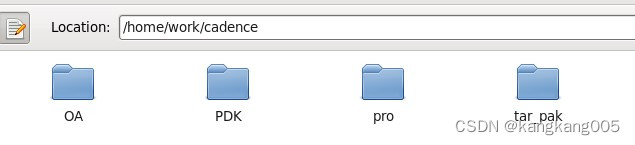
**OA/** 用于存放CDS to OA。
**PDK/** 用于存放转换成OA格式的工艺库。
**tar_pak/** 用于存放所下载的工艺库压缩包。
**pro/** 是virtuoso的工作路径，一般存放virtuoso启动时的关联库。

**注意**：每次启动virtuoso，必须确保工作目录下有两个文件：**cds.lib**（库文件）和**display.drf**（显示器件库），**cds.lib**包含一些工艺库或者加载文件库，可以通过在文件中直接添加或者删除文件库，或者可以通过virtuoso中添加或者删除库文件，后续会讨论。**display.drf**包含器件的颜色大小等属性，缺少**display.drf**文件，器件的颜色将无法正常显示，在编辑schematic时器件的颜色变成黄色。

3：在**tar_pak**下新建**tsmc18rf/**目录，将工艺库安装包（**tsmc18rf_pdk_v13d.tar**）拷贝到**tar_pak/**，并且解压至**tar_pak/tsmc18rf/**，一共7个，其中**pdkInstall.pl**是安装脚本。
**tar_pak**下的文件：
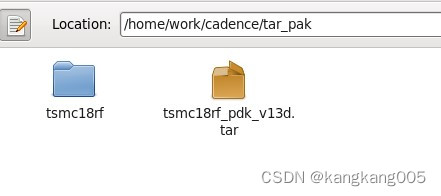
**tar_pak/tsmc18rf**下的文件：
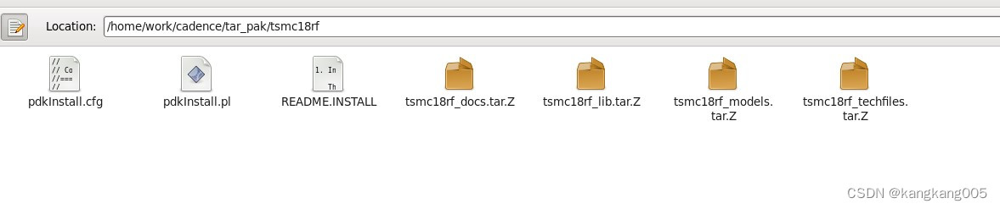
4：运行脚本文件**pdkInstall.pl**，注意：确保linux已经安装perl。
```
perl pdkInstall.pl
```
**注意**：在选择安装路径的时候必须选择不存在的路径，脚本会自动创建路径，否则脚本报错。这里选择**PDK/tsmc18rf**，其中**tsmc18rf**不存在。
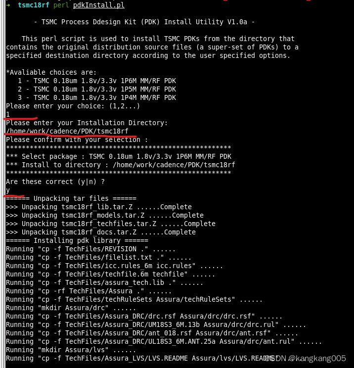
安装完后的所有文件如下（13个）：
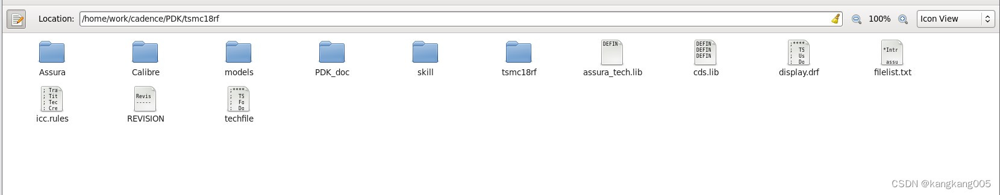
## 3.CDS to OA 格式转换
1：在~/**cadence/OA/CDS**下新建**cds.lib**并且编辑添加工艺库路径：
```
DEFINE tsmc18rf ~/cadence/PDK/tsmc18rf/tsmc18rf
```
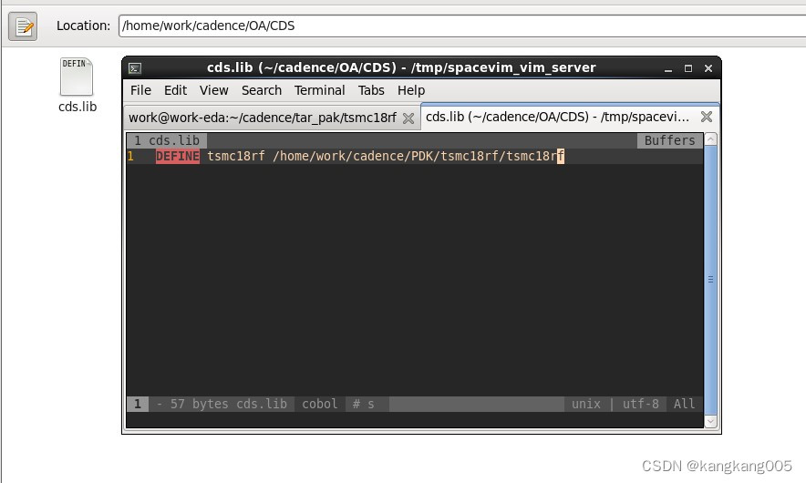
2：在**OA**目录下启动软件
```
virtuoso &
```
3：在菜单栏上选择**tools—>conversion toolbox**，弹出对话框，选择**CDB to OpenAccess Translator...**
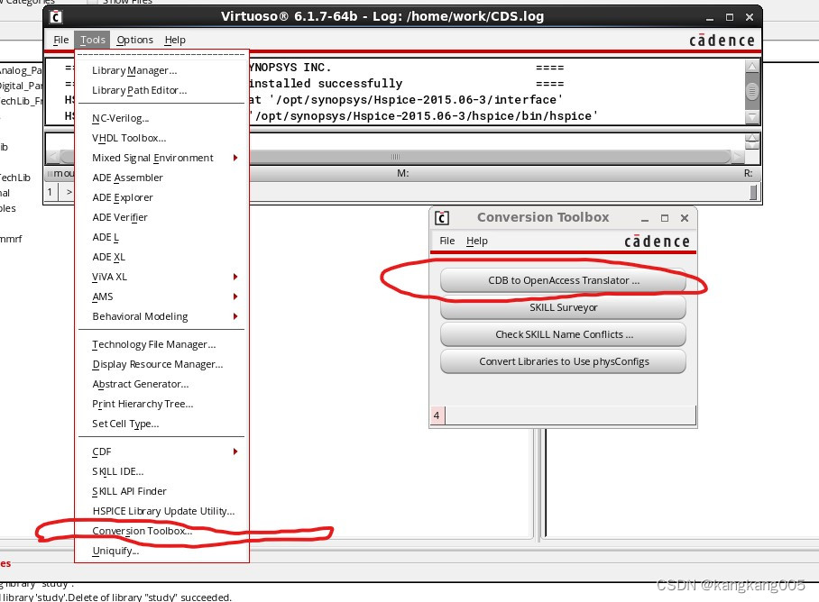
4：在**Browse..**中找到**OA/CDS/cds.lib**，在**Libraries to convert**中选中**tsmc18rf**，点击ok。
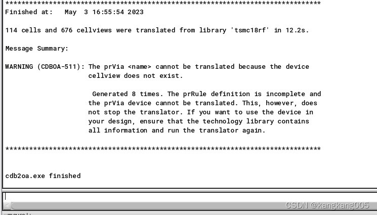
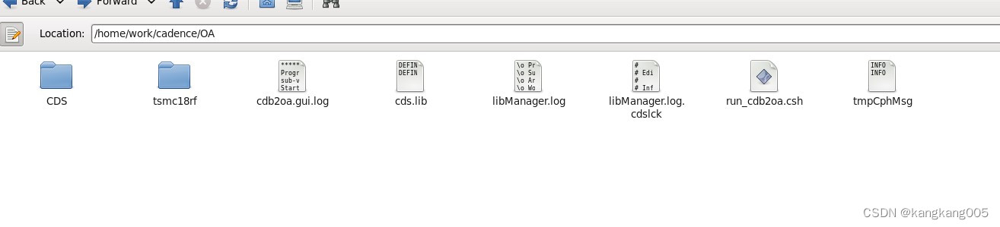
5：将该文件复制到**PDK**的工艺目录下，替换掉原来的**tsmc18rf**。
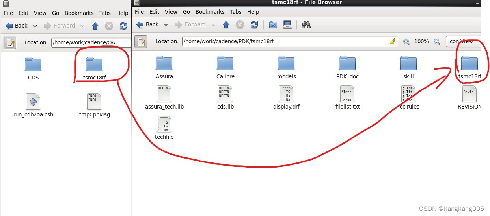
## 4.添加工艺库
1：修改权限
```
chmod -R 777 ~/cadence
```
2：在**pro**下编辑**cds.lib**并替换成一下代码：
```
SOFTINCLUDE /opt/cadence/IC617/share/cdssetup/dfII/cds.lib
SOFTINCLUDE /opt/cadence/IC617/share/cdssetup/hdl/cds.lib
SOFTINCLUDE /opt/cadence/IC617/share/cdssetup/pic/cds.lib
SOFTINCLUDE /opt/cadence/IC617/share/cdssetup/sg/cds.lib
```
其中包括内置工艺库，例如analogLib等。
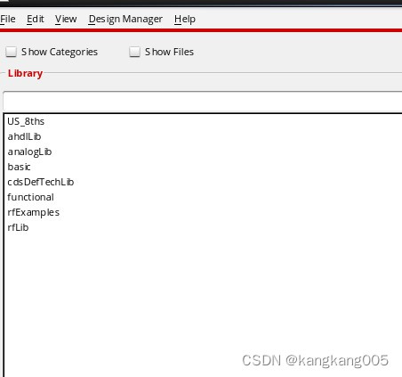
3：在**pro**下目录启动 virtuoso
```
virtuoso &
```
4：依次点击**library manager**菜单栏中的**Edit—>library path**。
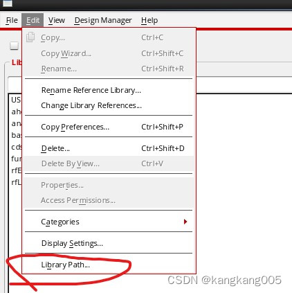
5：再依次点击**library path editor**菜单栏中的**Edit—>add library**。
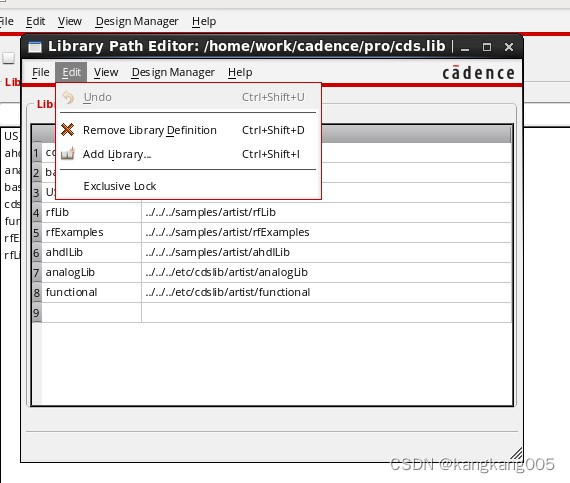
6：选择**PDK/tsmc18rf**下的工艺库**tsmc18rf**，点击ok。
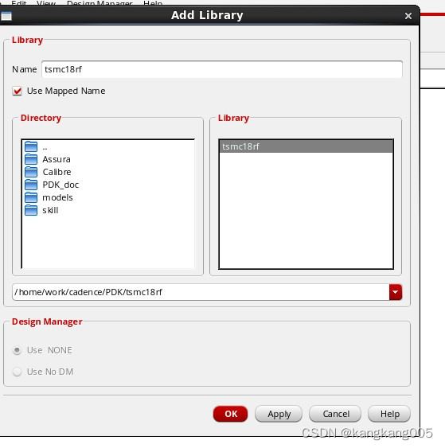
此时工艺库添加完成。
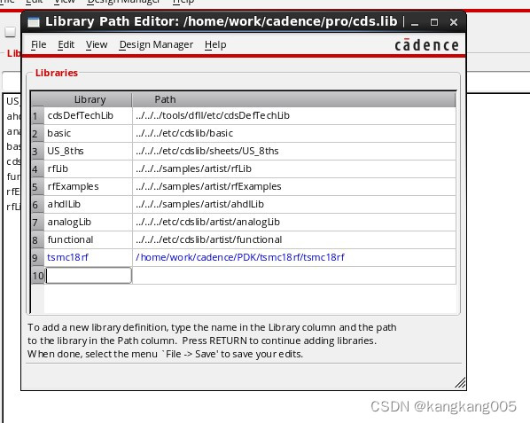
步骤4~6 是通过virtuoso中添加工艺库，除此之外，还可以直接在**pro/cds.lib**中编辑添加工艺库。
```
DEFINE tsmc18rf ~/cadence/PDK/tsmc18rf/tsmc18rf
```
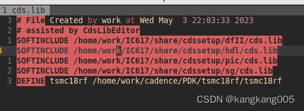
## 5.注意
### a.器件颜色错误
如果器件的颜色是黄色，代表virtuoso没有加载**PDK/tsmc18rf/display.drf**文件，需要将~/**cadence/PDK/tsmc18rf/display.drf**文件复制到**pro**目录下。
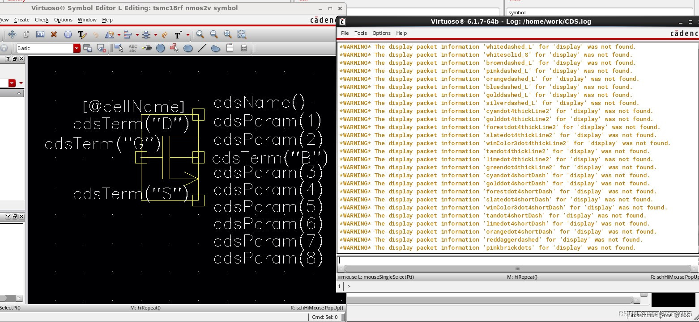
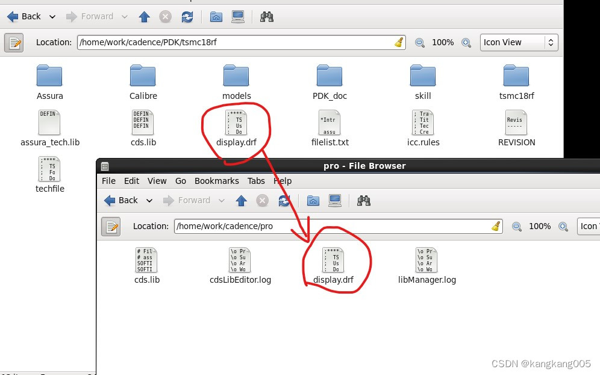
此时器件的颜色正常显示。
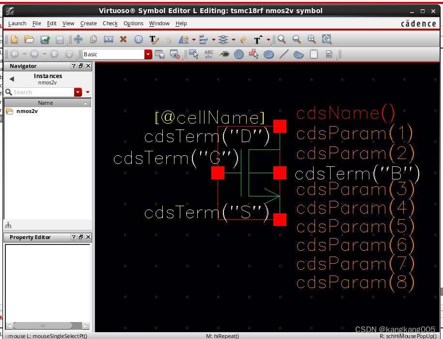
### b.CIW中存在 Error "asiEnvGetVar" 错误
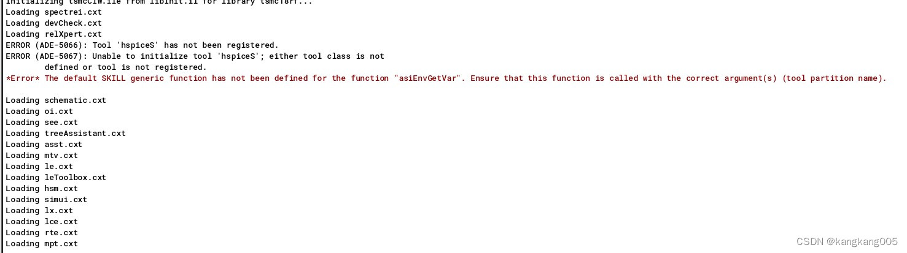
**解决**：因为没有安装Hspice，需要在/**home/work/cadence/PDK/tsmc18rf/tsmc18rf/libInit.il**文件中注释有关Hspice的代码。
```
;;asiSetEnvOptionVal(asiGetTool('hspiceS) "modelPath" strcat(libPath "/../models/hspice") )
;;asiSetEnvOptionVal(asiGetTool('hspiceS) "includeFile" "hspice.mdl")
```
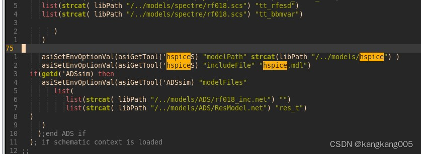
注释两行代码。
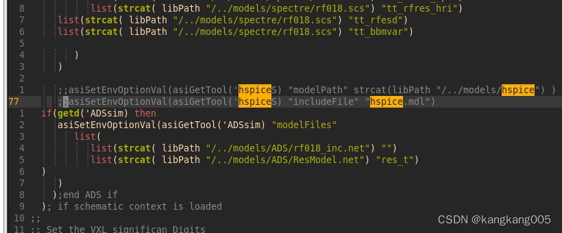
此时CIW没有报错。
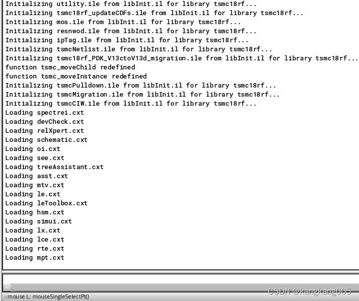