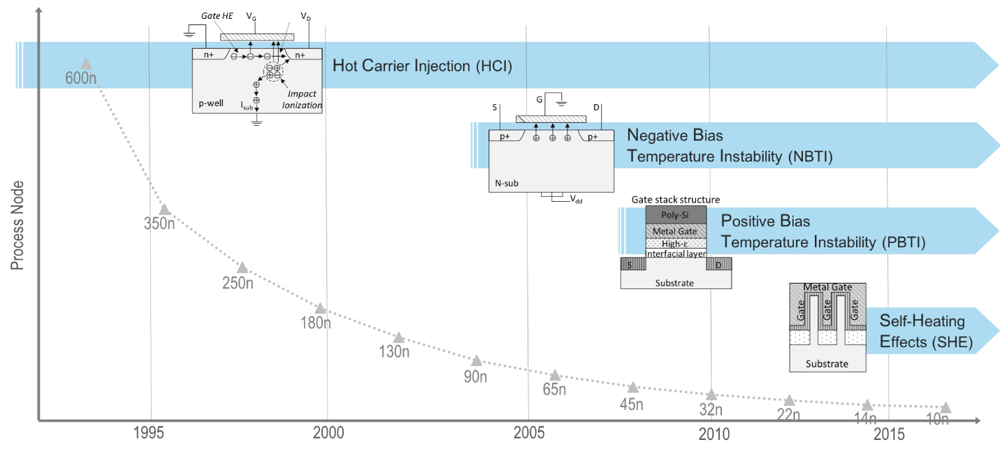

# 一、Aging
## 1、背景
随着晶体管的工作时间增加，晶体管的寿命和性能随之变差，从而导致晶体管老化效应（aging）。
目前导致晶体管老化的效应主要有**HCI(Hot Carrier injection 热载流子注入)**、**NBTI(Negative Bias Temperature Instability NMOS偏置温度不稳定性)**、**PBTI(PMOS偏置温度不稳定性)**、**SHE(Self-Heating Effect 衬底热载流子)**。

在制程350nm到130nm之间主要受到**HCI**影响，在制程130nm到45nm之间主要受到**HBTI**影响，在制程45nm到22nm之间主要受到**PBTI**影响，在制程22nm之后主要受到**SHE**影响。