## Post-simulation
XRC flow: calibre LVS + calibre XRC (Mentor EDA)
QCI flow: calibre LVS + cadence QRC (Mentor EDA + Cadence EXT EDA)
CCI flow: calibre LVS + StarRC (Mentor EDA + Synopsys EDA)
## CCI Flow (Starrc extract flow)
这里讨论用命令行的方式自动化验证，无需借助 GUI
* calibre 验证 lvs, 得到 svdb/: `calibre -turbo 4 -lvs -hier [-hcell hcell_list] calibre.lvs > run_calibre.log`
* 确保通过 lvs，否则修改 layout 再 lvs 直到成功为止
* calibre 读取 query_cmd: `calibre -64 -query svdb <[-query_input query_cmd] or [< query_cmd]> > calibre.log`
* starrc 进行后仿提取: `StarXtract -clean CCI_cmd >& star.log`
* 生成 spf

### LVS
calibre.lvs: lvs 的 rule 文件，注意其中有一段语句:
```
#IFDEF XRC_RUN TRUE
MASK SVDB DIRECTORY "svdb" QUERY XRC // Please modify XRC to CCI while you're running CCI flow
#ELSE
MASK SVDB DIRECTORY "svdb" QUERY CCI
#ENDIF
...
LVS REPORT "lvs.rep" // lvs report file name
```
注意，lvs 验证用的是 CCI 的 lvs 规则文件，因此 XRC_RUN 应该改成 FALSE: `DEFINE XRC_RUN FALSE`
在 -hier 的模式下可以减少 lvs 的验证时间。因为只会对同一种 block 进行 lvs，相同的 block 只会按一种 block 进行 lvs；如果是 -flat 模式，会将 block 和 cell 打散成 layer，相同的 block 还会再进行 lvs，验证时间延长但是更加精准。

执行完成后会生成 rep 文件以及 calibre log 及 svdb/ 的文件
```
                #       #######################         _   _
               #        #                     #         *   *
         #    #         #       CORRECT       #           |
          #  #          #                     #         \___/
           #            #######################
```
lvs.rep 中如果不出现 INCORRECT 字段表示 lvs 验证成功
### QA
####  LVS 验证时出现 “missing instance” 错误
进行版图 LVS 验证时出现 “missing instance” 错误，出现 instance 未定义问题，spi 网表需要 include PDK 目录里面的一个文件，TSMC 叫 source.added，SMIC 叫 empty_subckt.sp，里面定义的就是基本器件（PMOS、NMOS、电阻、电容），其实就是个带端口的空网表。include 进网表即可。

以 SMIC 为例:
1. 方法一
在 `calibre.lvs` 中加入以下语句:
```
SOURCE PATH "xxxx/xxxx/netlist.cir"       // Pre-simulation netlist
SOURCE PATH "xxxx/xxxx/empty_subckt.sp"   // Parasitic model netlist
```
2. 方法二
```
.include "xxxx/xxxx/netlist.cir"          # Pre-simulation netlist
.include "xxxx/xxxx/empty_subckt.sp"      # Parasitic model netlist
```
将上面语句写入 `lvs.cir` , 将 `calibre.lvs` 中的 `SOURCE PATH` 改为:
```
SOURCE PATH "xxxx/xxxx/lvs.cir"   // Include Pre-simulation and Parasitic netlist
```
https://blog.eetop.cn/blog-1768370-6951061.html
https://www.jianshu.com/p/774d8ec9b489
### query_cmd
query_cmd 是 Fab 厂商提供的，pdk 里面自带的文件
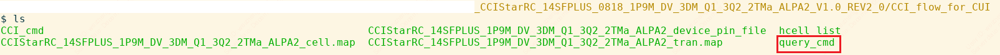
执行后会生成一系列 CCI_DB 相关的文件，calibre 的输出log中（calibre.log） 结果全为 ok 的话，表示没有问题
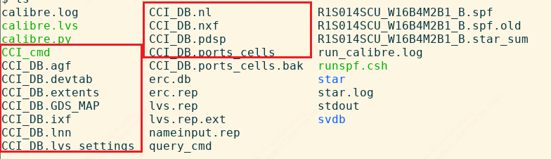
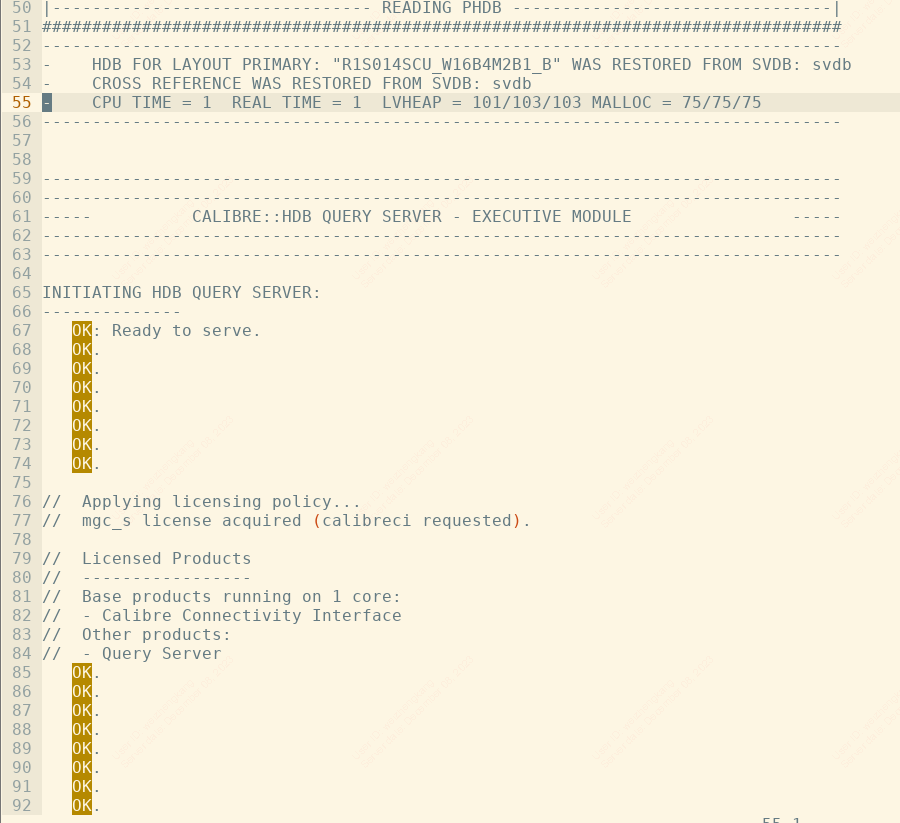
### StarRC
```
StarXtract -clean CCI_cmd >& star.log
```

其中 `-clean` 就是 Cleans all processes 的意思

CCI_cmd 也是 Fab 厂商提供的，pdk 里面自带的文件

需要改的配置如下：
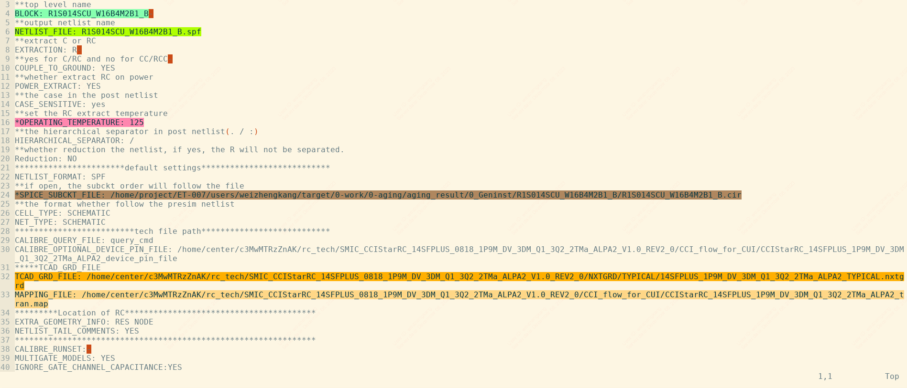
|Name                   |Description|
|---                    |---|
|BLOCK                  |topcell name|
|NETLIST_FILE           |post-simulation file name|
|OPERATING_TEMPERATURE  |temperature|
|TCAD_GRD_FILE          |Parasitic RC file, not readable file, be converted from itf file, which is tech description file of StarRC including RC layer, tech parameter and so on, more accurate than tluplus and captable|
|MAPPING_FILE           |define tech lef mapping to metal layer and via at RC file|

运行 StarRC 的 log 信息
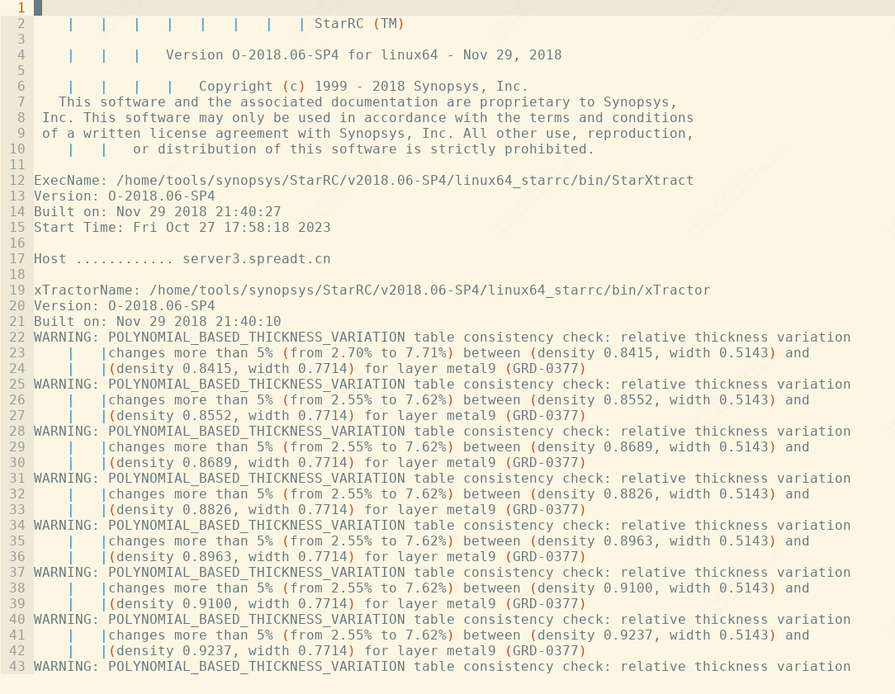
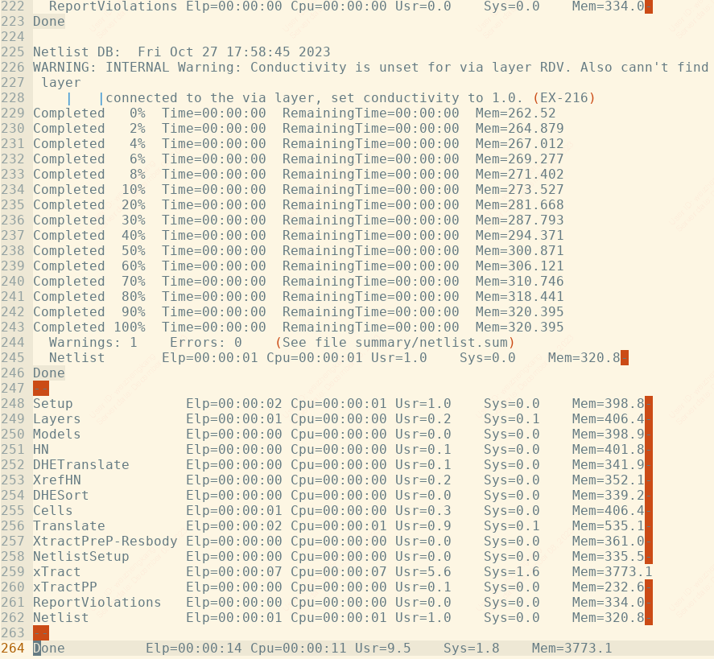

完成后输出 spf netlist 文件
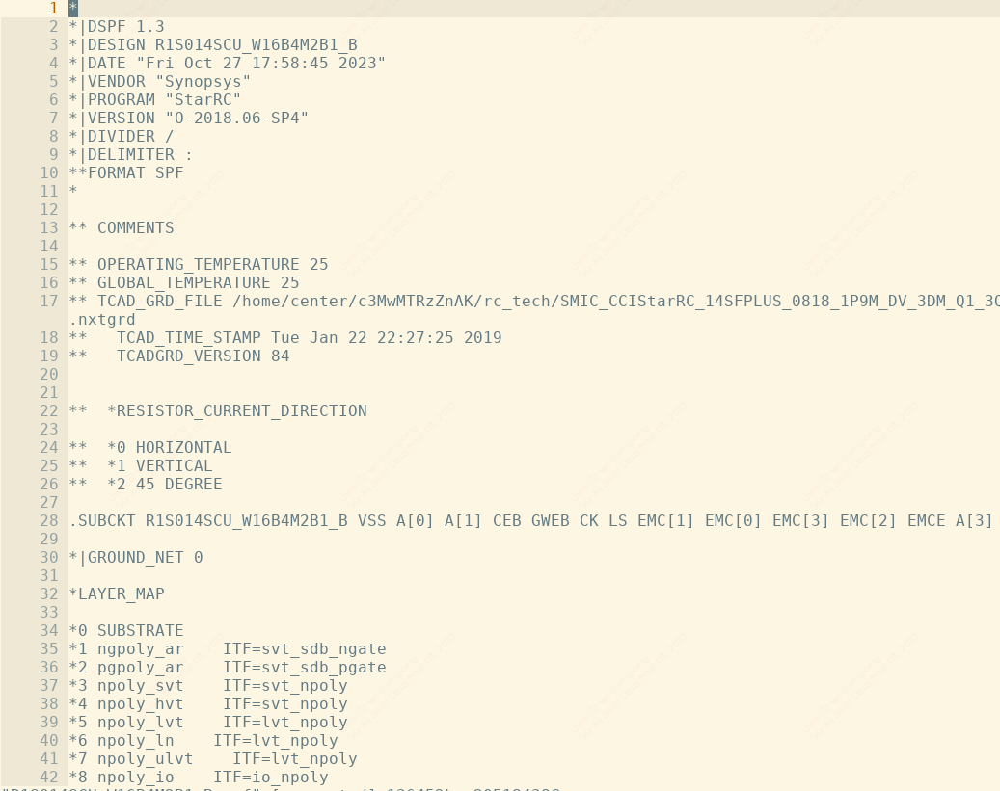

## 使用 post netlist + Spectre or Hspice 仿真
使用后仿 netlist 仿真时，除了 include post netlist，还需要 include 寄生模型库

spf netlist:
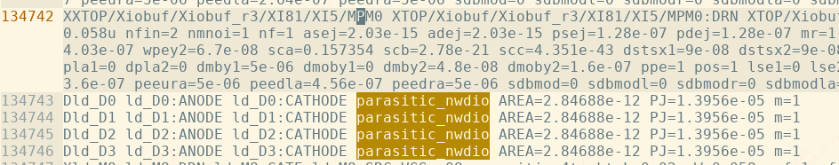
testbench:
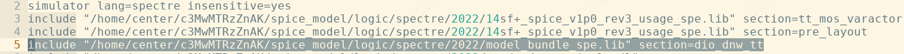
parasitic model:
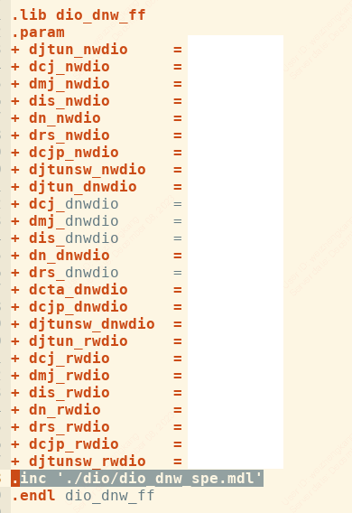
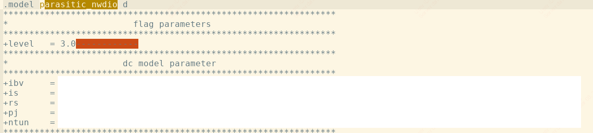