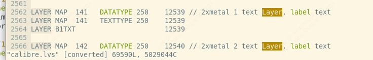
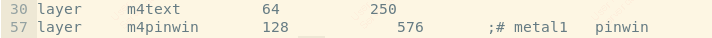
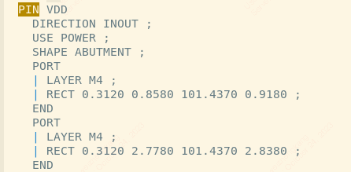

## Calibre
### layer number and datatype
https://bbs.eetop.cn/thread-357589-1-1.html
https://bbs.eetop.cn/thread-923858-1-1.html

datatype = 0 : 做掩模版, 其他的要不是 mark、net、dummy 什么的，这些是不会做版的。
12539 这个值没有任何含义，它也可以是 12539 或 122，只要它是唯一对应一个 layer 或者一组 gds number 相同的 layer 就行，它其实就是一个映射值，用于识别的。
定义你 gds 里的层 layno 10 datatype 0 = 1000 (可当作是个中间参数)。
## 为什么产生gds之后还要打power pin
因为lvs可能会报错。

## reg与wire的区别
https://zhuanlan.zhihu.com/p/471539431
https://www.zhihu.com/question/21021718
你用 verilog 写一个 simulation 的 testbench你会发现 input 永远是 reg，output 永远是 wire你再写一个 always block你会发现 output 永远是 reg，说白了只有 reg 才能在 always block 里面变值